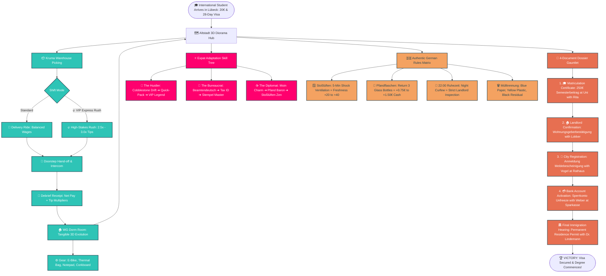

# Far From Home: Kruma Express — Game Mind Map & Narrative Character Design Authority

> **Authority Document**: This document serves as the master systemic mind map, narrative decision tree, and character interaction guide for *Far From Home: Kruma Express*. Every update to code, skills, or dialogue must be reflected here.

---

## 1. High-Level Game Systemic Mind Map



---

## 2. Character Narrative Design & Interaction Matrix

| Character | Location | Voice & Tone | Alignment & Role | "Who Speaks What, When & What You Do" | Tangible Reward |
| :--- | :--- | :--- | :--- | :--- | :--- |
| **Rita Schneider** | University (`B_UNI`) | Sine (310Hz)<br>*Maternal & Orderly* | University Registrar | • **Day 1**: Explains the 250€ *Semesterbeitrag* & prompts Strategy Choice (Hustler / Diplomat / Scholar).<br>• **Deep Story**: Shares her daughter studying abroad in Tokyo.<br>• **Goal**: Accept 250€ fee and grant official *Immatrikulationsbescheinigung*. | 🎓 **Matriculation Certificate** (Unlocks Bank & Visa steps) |
| **Klaus "Der Blitz"** | Dark Store (`B_DARKSTORE`) | Triangle (355Hz)<br>*Competitive Speedster* | Veteran Courier Rival | • **Day 1+**: Challenges your bike handling on wet cobblestones.<br>• **Mentorship**: Teaches corner drifting and aerodynamic drafting.<br>• **Lore**: Friendly rivalry with Nina over safety vs. pure speed. | ⚡ **+1 Skill Point** (The Hustler Branch) |
| **Nina Lindemann** | Dark Store (`B_DARKSTORE`) | Triangle (340Hz)<br>*Pragmatic & Street-Smart* | Kruma Dispatch Lead | • **Shift Start**: Choose between **Standard Shift** or **🔥 High-Stakes VIP Express Rush**.<br>• **Lore**: Explains her 80 km/day backstory to pay tuition and fight for fair rider treatment.<br>• **Shortcuts**: Reveals alley behind St. Mary’s Church. | 🚴 **Shift Dispatch** & 2.5×–3.0× Tips |
| **Hans Lokker** | WG Dorm (`B_WG`) | Sawtooth (160Hz)<br>*Gruff Caretaker* | Landlord & Caretaker | • **Encounter**: Enforces 22:00 *Ruhezeit* and no shoes in hallways.<br>• **Emotional Moment**: Talks about his late wife Anna and church bells.<br>• **Quest Action**: Accept warm Butter Croissant bribe from Bakery Hansa. | 📜 **Landlord Confirmation** (*Wohnungsgeberbestätigung*) |
| **Nico** | Hostel (`B_HOSTEL`) | Triangle (265Hz)<br>*Helpful Expat Senior* | Student Roommate | • **Survival Lore**: Shares the 3 golden rules of surviving your first month.<br>• **Interactive Action 1**: Return empty Club-Mate *Pfand* bottles.<br>• **Interactive Action 2**: Practice 5-minute *Stoßlüften* in dorm room.<br>• **Emotional Beat**: Sunday 2-hour phone calls home to family. | 🍾 **+0.75€ to +1.50€ Cash**<br>🌬️ **+20 to +40 Freshness** |
| **Martha Webber (Oma)** | Bakery Hansa (`B_BAKERY`) | Sine (215Hz)<br>*Warm Grandmother* | District Heart | • **Food Purchase**: Sourdough bread (+10 Freshness) & Franzbrötchen.<br>• **Sidequest**: Sells warm butter croissant for 2.00€ to soften Hans Lokker.<br>• **Emotional Moment**: Story of rebuilding Lübeck post-war through mutual aid. | 🥐 **Butter Croissant Item** & Morale Boost |
| **Mathias Becker** | Pizzeria (`B_PIZZA`) | Sawtooth (175Hz)<br>*Passionate Artisan* | Chef & Bike Mechanic | • **Food Purchase**: 8.00€ stone-baked Pizza Margherita (+20 Freshness).<br>• **Immigrant Story**: Arrived from Naples in 1994 with 50 Marks.<br>• **Diplomacy**: Form a truce over outdoor terrace bike parking. | 🍕 **20% Food Discount** & +25 Relationship |
| **Dr. Anke Schmidt** | University (`B_UNI`) | Sine (300Hz)<br>*Tenacious Advocate* | AStA Student Legal Aid | • **Legal Guidance**: Advises international students on tenant rights and university bylaws.<br>• **Emergency Aid**: Grants legal orientation bursary.<br>• **Lore**: Empowering students to resist landlord overreach. | 📑 **+1 Skill Point** (The Bureaucrat Branch) |
| **Herr Vogel** | Bürgeramt (`B_RATHAUS`) | Square (200Hz)<br>*Pedantic Official* | Municipal Registrar | • **Requirement**: Demands Passport + signed *Wohnungsgeberbestätigung* from Lokker.<br>• **Philosophy**: Explains why stamped forms protect democratic rights against arbitrary power.<br>• **Action**: Double-stamps municipal registration certificate. | 📑 **Meldebescheinigung** (City Registration Certificate) |
| **Frau Weber** | Sparkasse (`B_BANK`) | Sine (290Hz)<br>*Methodical Banker* | Bank Advisor | • **Requirement**: Demands Matriculation Certificate + Meldebescheinigung.<br>• **Action**: Unlocks German Girokonto & activates blocked account (*Sperrkonto*).<br>• **Wisdom**: Reinvest wages early into tools that save courier time. | 💳 **Sperrkonto Activated** (+50€ Monthly Disbursement) |
| **Dr. Lindemann** | Ausländerbehörde (`B_AUSLAENDER`)| Sine (250Hz)<br>*Stern & Fair Director* | Immigration Director | • **Check**: Audits complete 4-document dossier.<br>• **Verdict**: Validates resilience and grants permanent *Aufenthaltstitel* (Game Win). | 🏆 **VICTORY**: Residence Permit Granted |

---

## 3. The Expat Adaptation Skill Tree Deep Dive

```
                             [START: 1 Skill Point on Arrival]
                                             │
      ┌──────────────────────────────────────┼──────────────────────────────────────┐
      ▼                                      ▼                                      ▼
[🚴 THE HUSTLER]                       [📜 THE BUREAUCRAT]                    [☕ THE DIPLOMAT]
Tier 1 (1 SP): Cobblestone Drift       Tier 1 (1 SP): Beamtendeutsch Decoded  Tier 1 (1 SP): Northern "Moin" Charm
➔ +25% Bike Speed on Cobblestones      ➔ Unlocks AStA +25€ Bursary            ➔ -20% Shop & Food Costs
      │                                      │                                      │
Tier 2 (2 SP): Quick-Pack Vision       Tier 2 (2 SP): Steuer-ID Exemption     Tier 2 (2 SP): Pfand Baron
➔ +3.0s Grace Picking Timer            ➔ +15% Net Shift Wages                 ➔ Double Bottle Returns (1.50€)
      │                                      │                                      │
Tier 3 (3 SP): VIP Rush Legend         Tier 3 (3 SP): Stempel Master          Tier 3 (3 SP): Stoßlüften Zen
➔ Guaranteed 3.0x VIP Tips             ➔ Auto-Approves Missing Checks         ➔ Stamina Decays 50% Slower (+40 Fresh)
```

---

## 4. The German Chaos & Cultural Rules Matrix

*(Derived strictly from the Master Authority Document: `Docs/GERMAN_EXPATS_LIVING_RULES_AND_LAWS.md`)*

1. **The 20-Hour Rule & Employment Law (§16b AufenthG)**:
   - International students are legally capped at **20 hours per week**.
   - Primary official contract (Kruma Express) logs registered tax hours.
   - Off-the-books side cash gigs (Mathias's Pizzeria / Oma's Bakery) pay below minimum wage (8€/hr) in envelope cash (*Schwarzgeld*), ignoring the 20h quota but raising **Zoll / Ordnungsamt risk**.

2. **The 4-Document Sequential Dependency**:
   - You *cannot* unlock your **Sperrkonto (Bank)** without **Anmeldung (Bürgeramt)**.
   - You *cannot* do **Anmeldung** without **Wohnungsgeberbestätigung (Landlord Lokker)**.
   - You *cannot* finalize **Visa (Dr. Lindemann)** without all 4 documents + Tuition cleared.

3. **Statutory Health Insurance & Semesterticket**:
   - Matriculation requires statutory student health insurance (TK/AOK at 125€/mo).
   - Paying the 250€ Semesterbeitrag unlocks the regional **Semesterticket**, preventing 60€ *Schwarzfahren* fines.

4. **Daily Micro-Actions**:
   - **Pfand Recycling**: Interacting with Nico yields instant grocery cash (0.25€ single-use / 0.15€ glass).
   - **Stoßlüften**: 5-minute room shock ventilation prevents mold penalties from Lokker and restores Freshness.
   - **22:00 Ruhezeit**: Ending shifts late requires quiet, polite customer interactions to avoid noise penalty deductions.
   - **Punctuality & Etiquette**: Doorstep greeting choices determine whether you receive generous cash tips (+15€) or noise/attitude deductions (-4€).

---

## 5. Master Verification Scale for AI Agents

Before writing code or editing game narrative, every AI agent MUST evaluate against this scale:
- [ ] **20-Hour Quota Check**: Does this respect the weekly 20h student limit or frame excess as *Schwarzarbeit*?
- [ ] **Document Order**: Does the quest chain follow the strict sequential dependency (Lease ➔ Anmeldung ➔ Bank ➔ Uni ➔ Visa)?
- [ ] **Cultural Authenticity**: Are authentic German terms used properly (*Stoßlüften*, *Ruhezeit*, *Pfand*, *Mülltrennung*, *Beamtendeutsch*)?
- [ ] **Economic Sanity**: Do wages (€13.50 legal vs. €8.00 cash), fines (€60 Schwarzfahren), and costs (€250 Semesterbeitrag) match canonical German realities?
- [ ] **Build Integrity**: Run `node build/assemble.js` and `node build/check-size.js` to ensure the build remains `< 35 MB` and 100% offline airgapped.

