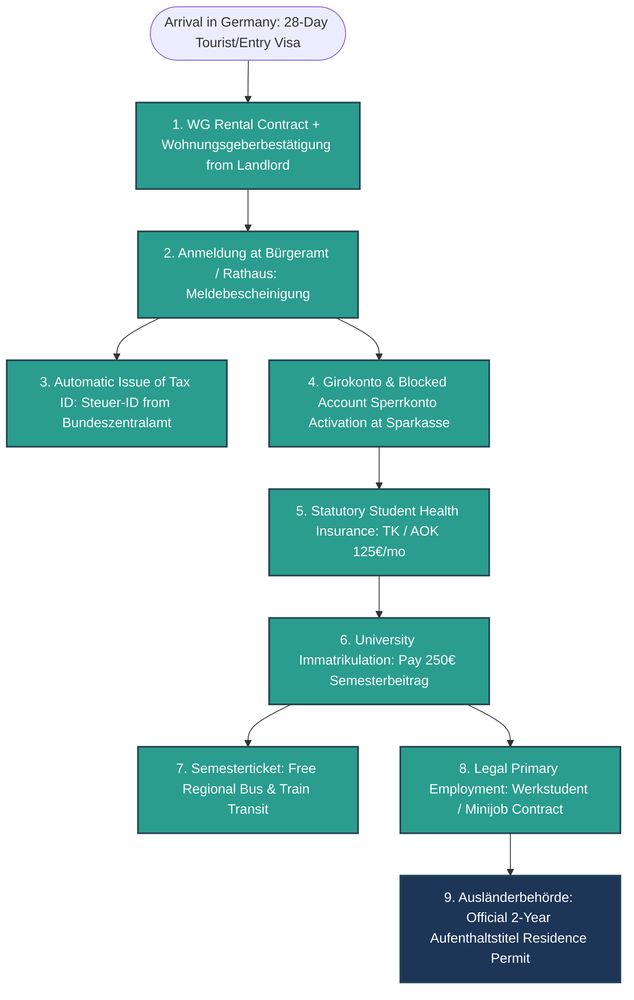

# The Ultimate Compendium of German Expat Laws, Bureaucracy & Everyday Life Rules

> **Master Authority Document for *Far From Home: Kruma Express***> Every game design system, narrative branch, character dialogue, and code mechanic MUST strictly align with the real-world laws and cultural realities documented here.

---

## 1. The Legal & Bureaucratic Hierarchy (The Catch-22 Chain)

In Germany, you cannot simply "do" things in arbitrary order. Every legal status is sequentially locked behind preceding government certificates:

---

## 2. Comprehensive German Rulebook Matrix

### A. Visa & Immigration (§16b AufenthG. Student Residence Law)
1. **The 20-Hour Rule (*20-Stunden-Regel*)**:
   -International students are strictly forbidden from working more than **20 hours per week** during the semester.
   -Annual legal quota: **140 full working days** (more than 4 hours) or **280 half working days** (up to 4 hours) per calendar year.
   -Working beyond 20h/week revokes student status, classifies you as a full employee subject to heavy social contributions, and violates your visa terms!
2. **Blocked Account (*Sperrkonto*)**:
   -Requires ~11,208€/year (approx. 934€/month) locked in a German bank account to prove living subsistence.
   -Payout is strictly metered to exactly 934€ on the 1st of every month, you cannot withdraw it in bulk!
3. **The 28-Day Entry Visa Deadline**:
   -You must submit your complete, stamped 4-document dossier to the *Ausländerbehörde* before your temporary entry visa expires, or face deportation proceedings (*Ausweisung*).

---

### B. City Registration (*Anmeldung*) & Housing Laws
1. **The 14-Day Legal Registration Law (*Bundesmeldegesetz*)**:
   -Every resident must register their address at the *Bürgeramt* within **14 days** of moving in.
   - **The Catch-22**: You CANNOT register without the landlord's signed *Wohnungsgeberbestätigung* (Landlord Confirmation of Residence). A regular lease alone is not enough!
2. **Landlord Obligations & Tenant Protections**:
   -Landlords are strictly barred from entering a student's room unannounced (breach of domestic peace, *Hausfriedensbruch*).
   -Deposit (*Kaution*) is capped at 3 months of cold rent (*Kaltmiete*) and must be held in a separate escrow account.
3. **The Broadcast Fee (*Rundfunkbeitrag / GEZ*)**:
   -Fixed legal fee of **18.36€ per month per apartment** (shared among WG flatmates), regardless of whether you own a TV or radio. Letters with yellow envelopes arriving with late payment warning fees (*Mahnung*) are inevitable.

---

### C. Taxes, Social Security & Employment Contracts
1. **Tax Identification Number (*Steuer-ID*)**:
   -An 11-digit lifelong number issued automatically by the *Bundeszentralamt für Steuern* 2 to 3 weeks after *Anmeldung*. Without it, employers must deduct maximum emergency tax under **Tax Class VI (Steuerklasse 6)** (up to 45%+ withheld!).
2. **Tax Classes**:
   - **Tax Class 1 (*Steuerklasse I*)**: Standard for single students (tax-free allowance up to ~11,604€/year).
   - **Tax Class 6 (*Steuerklasse VI*)**: Applied to second jobs or when your Tax ID is missing.
3. **Minijob (538€-Basis) vs. Werkstudent**:
   - **Minijob**: Earn up to 538€/month tax-free and exempt from statutory pension/health deductions.
   - **Werkstudent**: Work up to 20h/week; exempt from health, nursing care, and unemployment insurance deductions, paying only reduced statutory pension (9.3%).
4. **The "Schwarzarbeit" (Off-the-Books Cash) Dilemma**:
   -Performing uncontracted work for cash in hand (*Schwarzgeld*) violates the *Schwarzarbeitsbekämpfungsgesetz*.
   - **The Reality**: Employers pay below legal minimum wage (e.g. 8€/hr instead of 13.50€), offer zero injury insurance (*Berufsgenossenschaft*), and expose you to spot checks by the customs and labor authority (*Finanzkontrolle Schwarzarbeit / Zoll*).

---

### D. Statutory Health Insurance (*Gesetzliche Krankenversicherung*)
1. **Mandatory Coverage**:
   -Enrollment at any German university is impossible without valid statutory student health insurance (Techniker Krankenkasse / AOK / Barmer), costing approximately **125€ to 130€ per month**.
2. **The Electronic Health Card (*Gesundheitskarte*)**:
   -Grants free doctor consultations and emergency hospital care. Sick notes (*Arbeitsunfähigkeitsbescheinigung / Krankschreibung*) must be submitted to employers within 3 days.

---

### E. University, Semesterbeitrag & Jobticket
1. **Semester Fee (*Semesterbeitrag*)**:
   -Approx. **250€ to 350€ per semester**. It is NOT tuition (university education is state-funded), but covers student union (*Studierendenwerk*) administration, AStA legal aid, and the transit ticket.
2. **The Semester Ticket (*Deutschlandticket / Semesterticket*)**:
   -Grants unlimited travel on all regional trains (RB, RE), S-Bahn, U-Bahn, trams, and city buses across Germany.
3. **Public Transit Etiquette & Ticket Inspection (*Schwarzfahren*)**:
   -Riding without a valid ticket or student ID incurs an immediate **60€ fine (*Erhöhtes Beförderungsentgelt*)** and potential criminal referral for repeated offenses (§265a StGB).

---

### 🇩🇪 F. German Social Rules & Cultural Norms (*Alltagsregeln*)

1. **22:00 Ruhezeit (Statutory Quiet Hours)**:
   -By law, strict silence (*Nachtruhe*) begins at **22:00 until 06:00/07:00** on weekdays and all day on Sundays (*Sonntagsruhe*). No vacuuming, washing machines, loud music, or drilling.
2. **Mülltrennung (Waste Separation System)**:
   - **Blue Bin (*Altpapier*)**: Paper, cardboard, newspapers (clean only).
   - **Yellow Bin / Bag (*Gelber Sack / Wertstoff*)**: Plastic packaging, Tetra Paks, aluminum cans, foil.
   - **Brown Bin (*Biomüll*)**: Organic food scraps, coffee grounds, plant waste.
   - **Black/Grey Bin (*Restmüll*)**: Non-recyclable residual waste (hygiene items, dirty rags, broken ceramics).
   - **Glass Containers (*Altglas*)**: Separated strictly by color: White glass (*Weißglas*), Green (*Grünglas*), Brown (*Braunglas*). Depositing glass during *Ruhezeit* or on Sundays is strictly prohibited.
3. **Stoßlüften (Shock Ventilation Obligation)**:
   -Opening windows completely wide for **5 to 10 minutes, 2 to 3 times a day** (*Stoßlüften / Querlüften*) to exchange stale humid indoor air with dry outdoor air. German leases explicitly obligate tenants to do this to prevent structural mold (*Schimmelbildung*).
4. **Pfand (Deposit Return System)**:
   - **Einwegpfand (0.25€)**: Single-use plastic PET bottles and metal beverage cans (marked with DPG logo).
   - **Mehrwegpfand (0.08€ to 0.15€)**: Sturdy reusable glass beer and soda bottles, reusable plastic crates.
5. **Personal Liability Insurance (*Privathaftpflichtversicherung*)**:
   -Held by ~85% of Germans. Covers accidental damage (e.g. scratching a car with your bicycle or losing a master master-key of an apartment building).
6. **Social Etiquette & Norms**:
   - **Punctuality (*Pünktlichkeit*)**: Arriving 5 minutes early is considered on time; arriving 5 minutes late requires a formal apology.
   - **Direct Eye Contact Toasting (*Anstoßen*)**: When clinking glasses (*"Prost!"* / *"Zum Wohl!"*), you must maintain direct eye contact with every person, or face "7 years of bad luck".
   - **Formality (*Du vs. Sie*)**: Use *Sie* with officials, landlords, professors, and older residents until explicitly offered the *Du*.

---

## 3. The Living Verification Scale for Agents

Before implementing any new game mechanic, quest, NPC, or dialogue line, every AI agent MUST verify:
- [ ] **Legal Verification**: Does this respect the 20h student limit or explicitly frame violations as *Schwarzarbeit* risks?
- [ ] **Document Order**: Does the quest chain follow the strict sequential dependency (Lease to Anmeldung to Bank to Uni to Visa)?
- [ ] **Cultural Nuance**: Are terms used accurately (*Stoßlüften*, *Ruhezeit*, *Pfand*, *Mülltrennung*, *Beamtendeutsch*)?
- [ ] **Economic Sanity**: Do wages (€13.50 legal vs. €8.00 cash), fines (€60 Schwarzfahren), and costs (€250 Semesterbeitrag) match canonical German realities?
