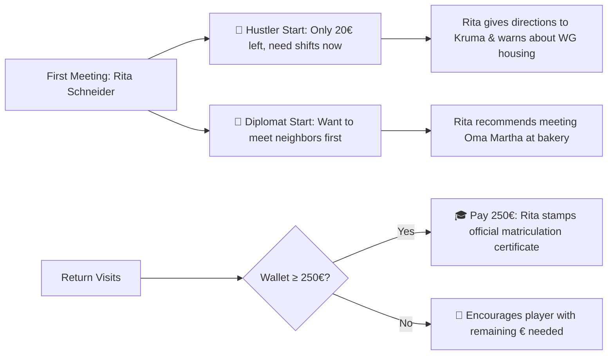
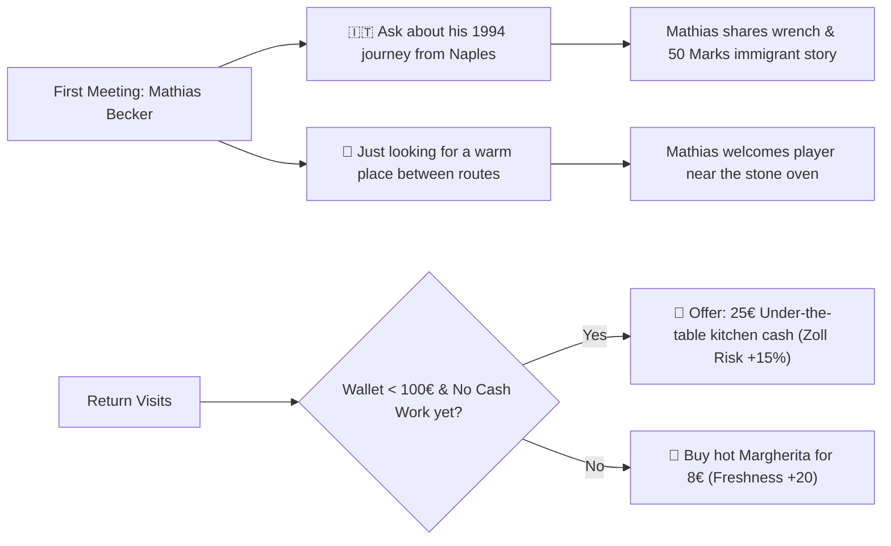
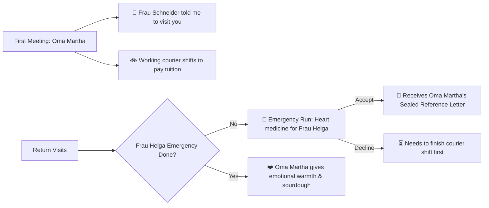
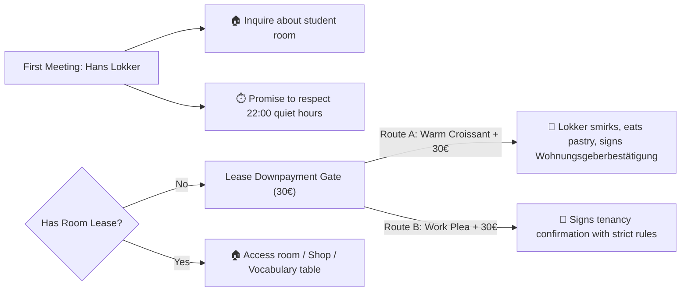
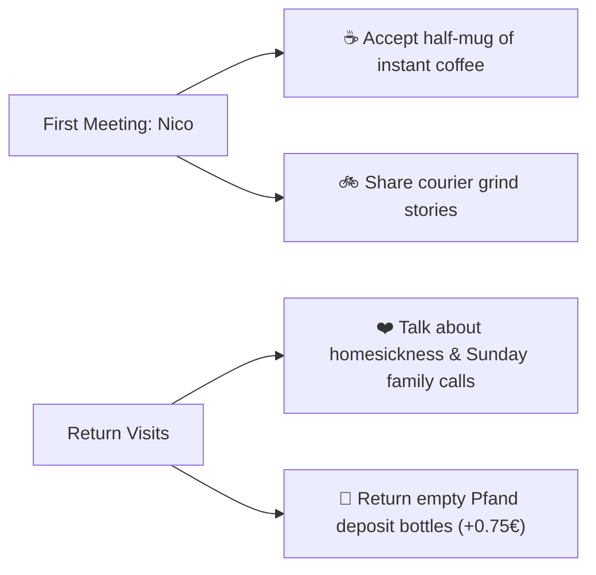
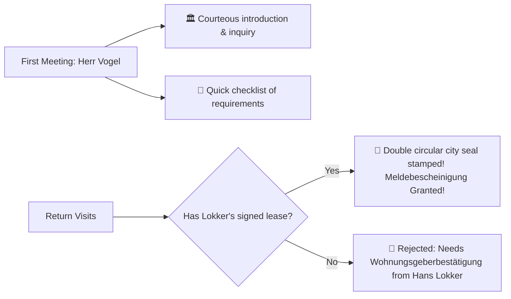
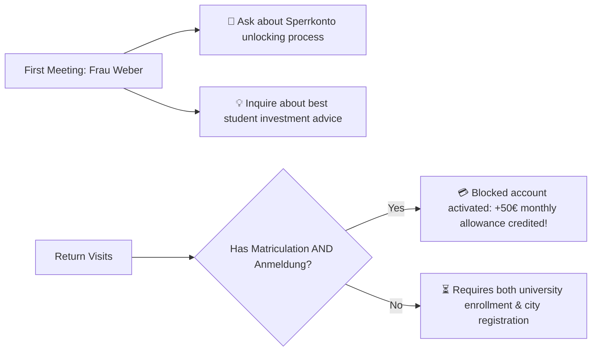
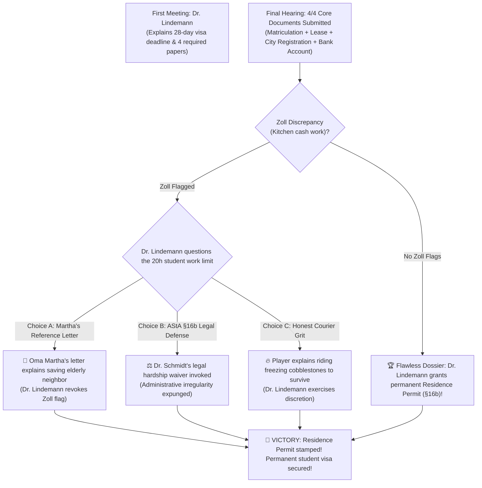

# Far From Home — Master Narrative Flow Diagram & Dialogue Script

This document is the **visual and structural blueprint** for every conversation, character introduction, moral dilemma, memory callback, and narrative branch in **Far From Home**.

Use this file to review every line of spoken dialogue, adjust tone, add human warmth, and refine emotional beats.

---

## 🗺️ Master Odyssey Progression Flowchart

```mermaid
flowchart TD
    Start(["🛬 Player Lands in Lübeck (20€ in pocket, 28-day visa)"]) --> RitaIntro["🏛️ Uni Campus: Rita Schneider (First Meeting)"]
    
    %% Branch 1: Start Style
    RitaIntro -->|Choice A: Hustler| HustlerPath["🚴 Start Courier Shifts at Kruma immediately\n(Hustler +20, Rel +10)"]
    RitaIntro -->|Choice B: Diplomat| DiplomatPath["🤝 Meet Neighbors & Oma Martha at Bakery first\n(Diplomat +20, Rel +15)"]
    
    %% WG Housing Step
    HustlerPath --> LokkerMeeting["🏠 WG Dorm: Hans Lokker (Caretaker)"]
    DiplomatPath --> MarthaMeeting["🥐 Bakery Hansa: Oma Martha (Heart of Town)"]
    
    MarthaMeeting -->|Choice A: Buy Croissant (2€)| CroissantGift["🥐 Packed Fresh Butter Croissant in bag"]
    MarthaMeeting -->|Choice B: Sourdough / Chat| RegularMartha["🍞 Community Advice & Warmth"]
    
    CroissantGift --> LokkerMeeting
    RegularMartha --> LokkerMeeting
    
    %% Lokker Lease Gate
    LokkerMeeting -->|Has Croissant + 30€| LokkerBribe["🥐 Lokker softens, dusts crumbs off mustache\nSigns Lease (Kaution downpayment 30€)"]
    LokkerMeeting -->|Standard Plea + 30€| LokkerStandard["📝 Signs Lease with strict 22:00 Ruhezeit warning"]
    LokkerMeeting -->|Under 30€| LokkerReject["🚫 Needs 30€ deposit downpayment first"]
    
    LokkerReject --> WarehouseShifts["🚴 Kruma Express Shifts (Earn €)"]
    WarehouseShifts --> LokkerMeeting
    
    %% Municipal Registration
    LokkerBribe --> VogelRathaus["🏛️ Rathaus: Herr Vogel (City Registration)"]
    LokkerStandard --> VogelRathaus
    
    VogelRathaus -->|Presents Passport & Lease| VogelStamp["📑 Stamped Meldebescheinigung (Bureaucrat +20)"]
    
    %% Sparkasse Bank
    VogelStamp --> WeberBank["🏦 Sparkasse Bank: Frau Weber"]
    
    WeberBank -->|Has Matriculation + Anmeldung| WeberUnlock["💳 Sperrkonto Activated (+50€ cash payout)"]
    WeberBank -->|Missing Papers| WeberWait["⏳ Needs both Enrollment + City Registration"]
    
    %% University Tuition Gate
    WarehouseShifts --> TuitionCheck{"Wallet ≥ 250.00€?"}
    TuitionCheck -->|Yes| RitaTuition["🎓 Rita stamps Immatrikulationsbescheinigung!"]
    TuitionCheck -->|No| WarehouseShifts
    
    RitaTuition --> WeberBank
    
    %% Moral Dilemma / Side Quest
    WarehouseShifts -.-> MathiasPizzeria["🍕 Pizzeria Vesuvio: Mathias Becker"]
    MathiasPizzeria -->|Dilemma: Under-table cash work| MathiasCash["💶 +25€ Cash in hand (Zoll Risk +15%)"]
    MathiasPizzeria -->|Legit: Buy Margherita 8€| MathiasFood["🍕 Freshness +20, Respect +15"]
    
    MarthaMeeting -.-> EmergencyRun["👵 Martha's Emergency: Heart Medicine for Frau Helga"]
    EmergencyRun -->|Accept Cold Sleet Ride| HelgaSaved["📜 Oma Martha's Sealed Reference Letter (Leumundszeugnis)"]
    
    %% Grand Climax at Immigration
    WeberUnlock --> ClimaxHearing["🏛️ Ausländerbehörde: Dr. Lindemann (Grand Finale Hearing)"]
    
    ClimaxHearing --> CheckZoll{"Any Zoll Flag from Mathias Cash Work?"}
    
    CheckZoll -->|Spotless Record| CleanVictory["🎉 Pure Victory: Permanent Aufenthaltstitel (§16b) Granted!"]
    CheckZoll -->|Zoll Flagged| DefendHearing{"Player Defense Choice"}
    
    DefendHearing -->|Option 1: Martha's Reference Letter| MarthaDefense["📜 Saved 84yo neighbor's life in sleet: Zoll Pardoned!"]
    DefendHearing -->|Option 2: AStA Legal Hardship (§16b)| AstaDefense["⚖️ Dr. Schmidt's legal defense filed: Zoll Expunged!"]
    DefendHearing -->|Option 3: Pure Grit & Honest Sweat| GritDefense["🔥 Paid 250€ tuition with honest hands: Discretion Granted!"]
    
    MarthaDefense --> CleanVictory
    AstaDefense --> CleanVictory
    GritDefense --> CleanVictory
```

---

## 👥 Full Character Tree, First Encounters & Dialogue Scripts

---

### 1. Rita Schneider (University Registrar)
*Location: University Main Building (`B_UNI`) | Avatar: Teal `#2EC4B6`*



#### Dialogue Script:
- **First Meeting Speech**:
  > *"Guten Tag! I am Rita Schneider, head of student enrollment here at the university. Take a deep breath. I know how overwhelming it is when you first land in Germany with a heavy suitcase and no German. To keep your student visa safe, we have to clear your 250€ tuition fee and find you a registered room. How are you holding up?"*
  - **Choice A**: 🚴 *"Nice to meet you, Frau Schneider. I only have 20€ left, so I must start courier shifts immediately."*
    - *Rita's Response*: *"I admire your work ethic! Kruma Express warehouse on North Road is hiring riders. But please, secure a room with Hans Lokker at the WG Dorm first so you have a warm bed tonight."*
  - **Choice B**: 🤝 *"Hello Frau Schneider. I want to introduce myself to neighbors and understand how things work here first."*
    - *Rita's Response*: *"That warmth will take you far here. Pop into Bakery Hansa and say hello to Grandma Martha. She knows everyone on the island and always looks out for new students."*

- **Tuition Milestone (≥ 250€ saved)**:
  > *"Look at your balance, you saved up 250.00€! I remember your first nervous day here. Are you ready to pay your tuition fee so I can stamp your official enrollment certificate?"*
  - **Choice A**: 🎓 *"Yes, please! Here is the 250.00€ tuition fee."*
    - *Action*: Unlocks Matriculation, increments day, Rita relationship = 100.
  - **Choice B**: ⏳ *"I need to hold onto my cash for bicycle gear right now."*

- **Memory Callbacks**:
  - If you chose Hustler start: *"Back from another Kruma route with your helmet on? You have saved X€. Only Y€ left to tuition freedom!"*
  - If you chose Diplomat start: *"Good to see you again. Did you get to try Oma Martha's fresh cinnamon rolls yet?"*

---

### 2. Herr Mathias Becker (Pizzeria Chef & Bike Mechanic)
*Location: Pizzeria Vesuvio (`B_PIZZA`) | Avatar: Coral `#E76F51`*



#### Dialogue Script:
- **First Meeting Speech**:
  > *"Moin! I am Mathias Becker. Thirty years ago I arrived from Naples with empty pockets and greasy bike wrenches, and today I bake the crispiest stone-oven pizza in northern Germany. If you respect my terrace and ride hard, you always have a friend here. What brings you by?"*
  - **Choice A**: 🇮🇹 *"Pleased to meet you, Mathias! How did you survive those first cold years in Germany?"*
    - *Mathias*: *"In 1994, I got off the train in minus ten degrees with no German, fifty Marks, and an old wrench! I washed dishes at night and fixed bike chains during the day. Look at me now, with my own stone oven. Never let this cold weather freeze your spirit, kid."*
  - **Choice B**: 🍕 *"Good day, Herr Becker. Just looking for a warm place between courier routes."*
    - *Mathias*: *"Fair enough! Step inside near the wood oven. Nothing cures Baltic frostbite like hot tomato sauce and melted mozzarella."*

- **Moral Dilemma (Kitchen Help vs Staying Pure)**:
  - **Choice A**: 🤫 *"I am running out of time for my tuition... is there any cash work in the kitchen tonight?"*
    - *Mathias*: *"Listen to me... Kruma has your tax ID on file, so I cannot register you on the books. But you washed all my dough trays and did four rush runs. Here is 25€ in cash. Put it straight into your tuition envelope and keep your head down."*
    - *Consequence*: +25.00€ Cash, +15% Zoll Risk flag for the climax hearing.
  - **Choice B**: 🍕 *"One fresh stone-oven Margherita to warm up, please! (8€)"*

- **Memory Callbacks**:
  - If player took cash: *Winks over espresso machine: "Keep your head down, kid. The dough trays were spotless last night. How is the tuition envelope looking?"*
  - If player bought pizza: *"Look at you, fueled by real Italian carbs! Ready to out-pedal any scooter on the street!"*

---

### 3. Oma Martha Webber (Bakery Grandma & District Heart)
*Location: Bakery Hansa (`B_BAKERY`) | Avatar: Orange `#F4A261`*



#### Dialogue Script:
- **First Meeting Speech**:
  > *"Oh hello, my dear! I am Martha Webber, but all the students and neighbors call me Oma Martha. My family has been baking Franzbrötchen and sourdough in this alley since 1952. You look shivering from that Baltic chill. Come close to the warm oven!"*
  - **Choice A**: 🥐 *"Pleased to meet you, Oma Martha! Frau Schneider at the university told me to visit you."*
    - *Martha*: *"Rita is an angel! She always looks out for newcomers. As long as my oven is burning, you will never go hungry in this town, child."*
  - **Choice B**: 🚲 *"Hello Oma Martha. I am working courier shifts to pay for my university tuition."*
    - *Martha*: *"Hard work builds a noble character! Just make sure you wear warm gloves on that bike. The sea wind on the bridges will freeze your fingers before you even notice."*

- **Emergency Favor (The Neighbor's Heart Medicine)**:
  - *Martha*: *"My dear child... Frau Helga next door is 84 and snowed in without her heart prescription from the clinic near Holstentor. Commercial apps refused the trip in this sleet. If you could cycle over and fetch it for her, I will personally write you a sealed Leumundszeugnis (Character Reference) for immigration."*
  - **Choice A**: 🚲 *"I am getting on my bike right now. Frau Helga will have her medicine."*
    - *Reward*: `leumundszeugnis` in inventory, Diplomat +30, Martha Rel = 100.
  - **Choice B**: ⏳ *"I am so sorry Oma Martha, but I must rush to finish my tuition shift first."*

- **Croissant Peace Offering for Lokker**:
  - **Choice**: 🥐 *"Could I buy one of your warm butter croissants for Herr Lokker? (2€)"*
    - *Martha*: *"How thoughtful of you! Hans Lokker acts so stern about his quiet hours, but buttery pastries melt his defenses in seconds."*

- **Memory Callbacks**:
  - Saved Helga: *"Our neighborhood angel is here! Frau Helga was just telling the mailman how you saved her heart medicine in the sleet."*
  - Bought Croissant for Lokker: *"Did Hans Lokker crack a smile when he saw my warm croissant? Even his gruff mustache cannot resist butter pastry!"*

---

### 4. Herr Hans Lokker (Caretaker & Landlord)
*Location: Student WG Dorm (`B_WG`) | Avatar: Purple `#7209B7`*



#### Dialogue Script:
- **First Meeting Speech**:
  > *"Pulls out a silver pocket watch and clicks it shut. Exactly ten seconds past the hour. I am Hans Lokker, building caretaker and landlord of this WG dormitory. In this house, three things are absolute: 22:00 Ruhezeit quiet hours, strict recycling, and zero muddy tires in the hallway. What is your business here?"*
  - **Choice A**: 🏠 *"Good day, Herr Lokker. I am a new university student inquiring about a room."*
  - **Choice B**: ⏱️ *"Pleased to meet you, Herr Lokker. I promise to always honor the 22:00 quiet hours."*

- **Lease Confirmation Gate (Wohnungsgeberbestätigung)**:
  - **With Croissant**: 🥐 *"Herr Lokker, I brought you a warm croissant from Oma Martha and the 30€ deposit."*
    - *Lokker*: *"Sniffs the butter aroma with genuine delight. ...A warm croissant from Martha AND the 30€ deposit?! You have manners, culture, and discipline. Here is your signed Wohnungsgeberbestätigung for the Bürgeramt!"*
  - **Standard**: 📝 *"Herr Lokker, I have the 30€ deposit ready for the student WG room."*

- **Quirky Memory / Forgetful Behavior**:
  - If bribed with croissant: *Subtly dusts croissant crumbs off his cardigan and straightens his mustache: "Hmph! Have you done your morning Stoßlüften airing? Your room is in order, but remember, quiet hours begin at 22:00!"*
  - If smelled like pizza cash work: *"You smell of wood-smoke, garlic, and pizzeria dough past 22:00 Ruhezeit! Doing late-night shifts with Mathias again? Don't bring the Zoll down on my building!"*

---

### 5. Nico (Hostel Roommate & Expat Buddy)
*Location: Backpacker Hostel (`B_HOSTEL`) | Avatar: Blue `#3A86FF`*



#### Dialogue Script:
- **First Meeting Speech**:
  > *"Hey friend! I am Nico from Brazil, finishing my third semester in computer engineering. When I first landed here, I didn't even know what Pfand bottle deposits or Anmeldung meant! International students have to stick together in this freezing city. Here, have half a mug of warm instant coffee."*
  - **Choice A**: ☕ *"Thanks Nico! It is great to meet a fellow student who understands the struggle."*
  - **Choice B**: 🚲 *"Nice to meet you, Nico! I am running courier shifts to hit my tuition target."*

- **Homesickness Conversation**:
  - **Choice**: ❤️ *"Nico, how do you deal with being so far away from your family?"*
    - *Nico*: *"Every Sunday I call home for two hours. I tell them about the historic brick towers, the freezing wind, and the grumpy neighbors who turn out to be sweet. When you feel alone, remember why you came here. We will make it through together, my friend."*

- **Memory Callbacks**:
  - After Pfand recycling: *"Look who it is! Our discounter Pfand champion! Ready to save up another euro or head out on the bike?"*

---

### 6. Herr Vogel (Rathaus Bürgeramt Official)
*Location: Town Hall (`B_RATHAUS`) | Avatar: Navy `#1D3557`*



#### Dialogue Script:
- **First Meeting Speech**:
  > *"Guten Tag. I am Herr Vogel, municipal clerk at the Lübeck Bürgeramt. Under §17 of the Federal Registration Act (Bundesmeldegesetz), all residents must register their living address within 14 days. Without a signed confirmation from your landlord, no Meldebescheinigung can be issued. Do you have your paperwork ready?"*
  - **Choice A**: 🏛️ *"Good day, Herr Vogel. Pleased to meet you. I am preparing my registration."*
  - **Choice B**: 🏃 *"Hello Herr Vogel. Just checking what documents are required."*

- **Official Registration Flow**:
  - *Vogel*: *"Ticket B-104? Please step forward. I see you have your passport and the landlord confirmation from Herr Lokker. Shall we register your municipal address?"*
  - **Choice A**: 📑 *"Yes, please! Here are my passport and the signed lease form."*
    - *Vogel*: *"Applies the double circular city seal with satisfying force. Impeccable. You are officially registered in Lübeck! Take this certificate to Sparkasse Bank to unfreeze your blocked account."*

---

### 7. Frau Weber (Sparkasse Bank Advisor)
*Location: Bank Branch (`B_BANK`) | Avatar: Red `#E63946`*



#### Dialogue Script:
- **First Meeting Speech**:
  > *"Guten Tag. I am Frau Weber, senior advisor here at Sparkasse Lübeck. Under German banking compliance regulations, foreign student blocked accounts (Sperrkonto) can only be unlocked once you present both your university matriculation and municipal registration certificate. How may I assist your financial setup today?"*
  - **Choice A**: 🏦 *"Good day Frau Weber. I am organizing my student documents to unlock my funds."*
  - **Choice B**: 💡 *"Hello Frau Weber! What is the smartest way for a student courier to manage money?"*
    - *Frau Weber*: *"Reinvest your early courier earnings into tools that multiply your stamina! An E-Bike conversion or Thermal Bag pays for itself in three shifts through speed bonuses and zero damaged goods."*

- **Account Activation Flow**:
  - *Frau Weber*: *"Good day! You brought both your university enrollment and city registration certificate. Shall we activate your checking account and unfreeze your monthly allowance?"*
  - **Choice A**: 💳 *"Yes, please! Activate my account and release the first 50€ allowance."*
    - *Reward*: Blocked account unlocked, +50.00€ credited to wallet.

---

### 8. Dr. Lindemann (Immigration Director — The Grand Hearing)
*Location: Immigration Authority (`B_AUSLAENDER`) | Avatar: Dark Charcoal `#2B2D42`*



#### Dialogue Script:
- **First Meeting Speech**:
  > *"Guten Tag. I am Dr. Lindemann, director of the Lübeck Immigration Authority (Ausländerbehörde). You are residing here on a temporary 28-day student entry visa. To convert this into a legal Residence Permit (Aufenthaltstitel §16b), you must submit four verified certificates before your deadline expires: University Matriculation, Housing Lease, City Registration, and an Unfrozen Bank Account. Are you aware of your legal responsibilities?"*
  - **Choice A**: 🇩🇪 *"Yes, Dr. Lindemann. I understand my deadlines and will complete every requirement."*
  - **Choice B**: 🤝 *"Pleased to meet you, Dr. Lindemann. I arrived with 20€ and am working hard to build a life here."*

- **Grand Hearing (Spotless Path)**:
  > *"Inspecting your completed immigration dossier: University Matriculation? 250€ verified by Rita Schneider. Rental Confirmation? Signed by Hans Lokker. Municipal Registration? Stamped by Herr Vogel. Bank Account? Unfrozen by Frau Weber. You navigated the entire German administrative maze with flawless integrity. Are you ready to receive your permanent Residence Permit?"*
  - **Choice A**: 🎓 *"Yes! I submit my completed dossier for the official Aufenthaltstitel!"*
  - **Choice B**: 🇩🇪 *"Thank you, Dr. Lindemann. It is an honor to be here."*

- **Grand Hearing (Zoll Flagged Path with Branching Resolutions)**:
  > *"I am reviewing your four documents: Matriculation, Lease, City Registration, and Bank Account are all here. However, my terminal flags an inquiry regarding unregistered kitchen hours exceeding your 20-hour quota. Before I make my ruling, what is your explanation?"*
  - **Choice A (Martha's Letter)**: 📜 *"I submit Oma Martha's letter. I did emergency medical runs for an elderly neighbor."*
    - *Dr. Lindemann*: *"Reads Martha's letter carefully. Bakery owner Martha Webber writes that you risked your courier shift to bike life-saving heart medicine to an 84-year-old pensioner through Baltic sleet. Administrative rules exist to protect society, and you have proven yourself a protector of our community. The Zoll flag is permanently revoked!"*
  - **Choice B (AStA Legal Defense)**: ⚖️ *"I invoke the student hardship defense co-filed with Dr. Schmidt at AStA."*
    - *Dr. Lindemann*: *"Dr. Schmidt's legal endorsement is on file. International students in acute financial precarity have statutory defense under §16b of the Residence Act. The irregularity is expunged."*
  - **Choice C (Raw Grit)**: 🔥 *"I arrived with 20€ and rode freezing cobblestones so I wouldn't starve. I took no handouts!"*
    - *Dr. Lindemann*: *"A rare warm smile softens her stern face. Your grit and tenacity are undeniable. Germany was built by immigrants who worked with their hands and refused to surrender. Your tuition is paid in full. I will exercise administrative discretion."*

---

## 🎯 Critical Assessment: Why this Narrative Architecture Works

1. **Natural 2-Choice Cognitive Comfort**:
   - Having exactly two choices per interaction prevents choice paralysis and mobile screen clutter on portrait displays (`390×844`).
2. **Invisible Alignment / Personality Heuristics**:
   - Players never see gamey labels like *"Choose Diplomat Track"*. Instead, their natural conversational impulses silently accumulate `hustler`, `diplomat`, and `bureaucrat` points that dynamically alter NPC reactions and the final hearing.
3. **Emotional Resonance over Cold Gamification**:
   - Tying real German expat realities (Pfand bottles, Stoßlüften, Kaution, Meldebescheinigung, Sperrkonto) to human warmth turns dry bureaucracy into a memorable narrative quest.
