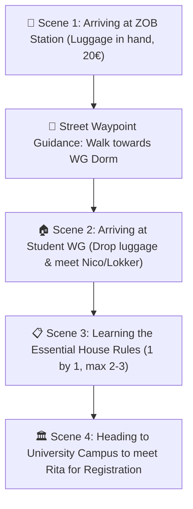
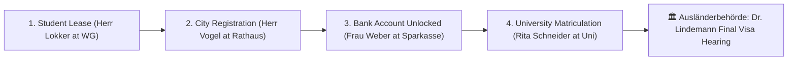

# 🎭 Far From Home — Scene-by-Scene Narrative & Dialogue Script

This document breaks down every conversation into **discrete, editable review sections**. You can comment directly on any section to tweak the wording, adjust the emotional weight, or insert your personal touch.

---

## 🎬 Narrative Act 1: The Arrival & First Steps

---

### 📍 Scene 1: Arrival at ZOB Station & Waypoint Navigation
- **Location**: `ZOB & Hauptbahnhof` (Northwest Mainland)
- **Player State**: Carrying heavy suitcase, 20.00€ cash, 28-day temporary visa.
- **Narrative Context**: You step off the train into the Baltic cold. The GPS/compass arrow points South toward your temporary sublet room at the WG Dorm.

> #### 💬 Scene 1 Dialogue / Narration:
> **Player Thought / Subtitle**:  
> *"Lübeck. Heavy Baltic air, freezing wind, and 20 euros left in my pocket. First priority: find my temporary WG room down South Street, drop off this heavy suitcase, and meet my flatmate before heading to the university."*
>
> **Interactive Feedback / HUD Banner**:  
> `🧭 Follow the glowing yellow street chevrons South to your WG Dorm (Student Sublet).`

---

### 📍 Scene 2: Entering the WG & Meeting Flatmate Nico
- **Location**: `Student Sublet (WG Dorm)` (`B_WG`)
- **Characters**: **Nico** (Senior International Student) & **Herr Hans Lokker** (Landlord / Caretaker).
- **Narrative Context**: You walk into the kitchen with your heavy suitcase. Nico is brewing instant coffee.

> #### 💬 Nico's First Encounter:
> **Nico**:  
> *"Hey! You must be the new roommate moving into Room 4. Put that heavy suitcase down on the rug! I am Nico from Brazil, 3rd semester. You look completely frozen. Here, take half a mug of warm instant coffee."*
>
> - **Choice 1**: ☕ *"Thanks Nico! I just landed from the train station. It feels so surreal to finally be here."*
>   - **Nico's Reply**: *"I know that exact feeling, brother. Landing in Germany with an empty wallet and no German is terrifying. But we stick together in this house. Let me introduce you to how things work before Lokker catches you."*
> - **Choice 2**: 🎒 *"Thank you so much. Where can I put my bags? I need to register at the university soon."*
>   - **Nico's Reply**: *"Room 4 is right down the hall. Drop your coat and bags on the bed. But heads up: before you run off to the campus, make sure you know the 2 big house rules here."*

---

### 📍 Scene 3: The 3 Core German Living Rules (Taught 1 by 1)
- **Narrative Context**: Nico explains the 2 to 3 absolute essentials of living in a German apartment so the player doesn't get overwhelmed.

> #### 💬 Nico Explains the Rules:
> **Nico**:  
> *"Herr Lokker is our caretaker. He looks grumpy, but he's fair if you respect three golden rules:*
>
> 1. **Ruhezeit (22:00 Quiet Hours)**: *After 10 PM, no loud music, no vacuuming, and keep the hallway quiet. In Germany, quiet hours are sacred.*
> 2. **Mülltrennung (Waste Sorting)**: *Blue bin for paper, yellow bag for plastics, black bin for rest. If you mix them up, Lokker will leave a sticky note on your door.*
> 3. **Stoßlüften (Shock Ventilation)**: *Open windows completely wide for 5 minutes twice a day to air out humidity. Never leave windows tilted in winter.*
>
> *Keep those 3 in mind and you will survive your first month easily!"*
>
> - **Choice 1**: 📝 *"Got it: 22:00 quiet hours, sort the trash, and open windows wide for 5 minutes."*
>   - **Nico's Reply**: *"Exactly! Now drop your luggage in your room. Next stop: Rita Schneider at the university campus across the bridge to get your registration started."*
> - **Choice 2**: 🤝 *"Thanks Nico, you just saved me from a landlord disaster."*
>   - **Nico's Reply**: *"That's what roommates are for! Go see Rita at the university. She will tell you what documents you need to keep your visa safe."*

---

### 📍 Scene 4: University Campus Registration (Rita Schneider)
- **Location**: `Universität zu Lübeck` (`B_UNI`)
- **Character**: **Rita Schneider** (Registrar)
- **Narrative Context**: Now that your bags are dropped and you have a base, you cross the river bridge to the university to start your enrollment.

> #### 💬 Rita's Introduction:
> **Rita**:  
> *"Guten Tag! Welcome to the University of Lübeck. I am Rita Schneider, head of student admissions. I see your provisional admission letter here in Akte B-104. To officially issue your Immatrikulationsbescheinigung (Enrollment Certificate), we need to clear your 250.00€ semester tuition fee. How are you situated financially?"*
>
> - **Choice 1**: 🚴 *"I only have 20€ in cash left, so I need to find work immediately to pay the 250€."*
>   - **Rita's Reply**: *"I understand completely. Kruma Express on South Street hires student couriers with instant daily payouts. Earn your tuition on the bike, bring back the 250€, and I will stamp your enrollment certificate right away!"*
> - **Choice 2**: 🤝 *"I just dropped my bags at the WG. What documents do I need to prepare?"*
>   - **Rita's Reply**: *"You will need your housing lease from Herr Lokker, your city registration (Anmeldung) from Herr Vogel at City Hall, and 250€ for tuition. Once those are together, your student visa is secure."*

---

## 🎬 Narrative Act 2: The Community & Working Life

---

### 📍 Scene 5: Pizzeria Vesuvio (Herr Mathias Becker)
- **Location**: `Pizzeria Vesuvio` (`B_PIZZA`)
- **Character**: **Herr Mathias Becker** (Pizza Chef & Bike Mechanic)

> #### 💬 Dialogue:
> **Mathias**:  
> *"Moin! I am Mathias Becker. Thirty years ago I arrived from Naples with empty pockets and greasy bike wrenches, and today I bake the crispiest stone-oven pizza in northern Germany. If you respect my terrace and ride hard, you always have a friend here. What brings you by?"*
>
> - **Choice 1**: 🇮🇹 *"Pleased to meet you, Mathias! How did you survive those first cold years in Germany?"*
>   - **Mathias**: *"In 1994, I got off the train in minus ten degrees with no German, fifty Marks, and an old wrench! I washed dishes at night and fixed bike chains during the day. Look at me now, with my own stone oven. Never let this cold weather freeze your spirit, kid."*
> - **Choice 2**: 🍕 *"Good day, Herr Becker. Just looking for a warm place between courier routes."*
>   - **Mathias**: *"Fair enough! Step inside near the wood oven. Nothing cures Baltic frostbite like hot tomato sauce and melted mozzarella."*

---

### 📍 Scene 6: Bakery Hansa (Oma Martha Webber)
- **Location**: `Bakery Hansa` (`B_BAKERY`)
- **Character**: **Oma Martha Webber**

> #### 💬 Dialogue:
> **Martha**:  
> *"Oh hello, my dear! I am Martha Webber, but all the students call me Oma Martha. My family has been baking Franzbrötchen and sourdough in this alley since 1952. You look shivering from that Baltic chill. Come close to the warm oven!"*
>
> - **Choice 1**: 🥐 *"Pleased to meet you, Oma Martha! Frau Schneider at the university told me to visit you."*
>   - **Martha**: *"Rita is an angel! She always looks out for newcomers. As long as my oven is burning, you will never go hungry in this town, child."*
> - **Choice 2**: 🚲 *"Hello Oma Martha. I am working courier shifts to pay for my university tuition."*
>   - **Martha**: *"Hard work builds a noble character! Just make sure you wear warm gloves on that bike. The sea wind on the bridges will freeze your fingers before you even notice."*

---

## 🎬 Narrative Act 3: The 4 Core Documents & Finale

---

### 📍 Scene 7: City Hall (Herr Vogel — Bürgeramt)
- **Location**: `Rathaus` (`B_RATHAUS`)
- **Character**: **Herr Vogel**

> #### 💬 Dialogue:
> **Vogel**:  
> *"Guten Tag. I am Herr Vogel, municipal clerk at the Lübeck Bürgeramt. Under §17 of the Federal Registration Act (Bundesmeldegesetz), all residents must register their address within 14 days. Do you have your landlord confirmation form ready?"*
>
> - **Choice 1**: 📑 *"Yes, Herr Vogel! Here are my passport and the signed lease from Herr Lokker."*
>   - **Vogel**: *Applies double circular city seal with satisfying force.* *"Impeccable. You are officially registered in Lübeck! Take this certificate to Sparkasse Bank to unfreeze your blocked account."*
> - **Choice 2**: 🏃 *"Hello Herr Vogel. Just double checking the requirements."*

---

### 📍 Scene 8: The Climax Hearing (Dr. Lindemann — Ausländerbehörde)
- **Location**: `Ausländerbehörde` (`B_AUSLAENDER`)
- **Character**: **Dr. Lindemann** (Immigration Director)

> #### 💬 Climax Dialogue:
> **Dr. Lindemann**:  
> *"Inspecting your completed immigration dossier: University Matriculation verified by Rita Schneider. Rental Confirmation signed by Hans Lokker. Municipal Registration stamped by Herr Vogel. Bank Account unfrozen by Frau Weber. You navigated the entire German administrative maze with flawless integrity. Are you ready to receive your permanent Residence Permit?"*
>
> - **Choice 1**: 🎓 *"Yes! I submit my completed dossier for the official Aufenthaltstitel!"*
>   - **Dr. Lindemann**: *"Your application is approved under §16b of the Residence Act. Welcome to Germany as a permanent university student!"*
> - **Choice 2**: 🇩🇪 *"Thank you, Dr. Lindemann. It is an honor to be here."*

---

### ✍️ How to Review & Edit:
1. You can quote any **Scene (1 through 8)** or character in your reply.
2. Tell me which sentences you want to change, rephrase, make funnier, or make more emotional.
3. Once approved, I will implement all changes directly into the codebase!
