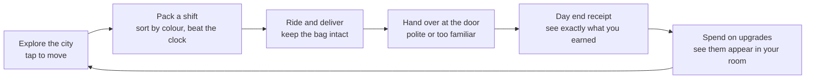
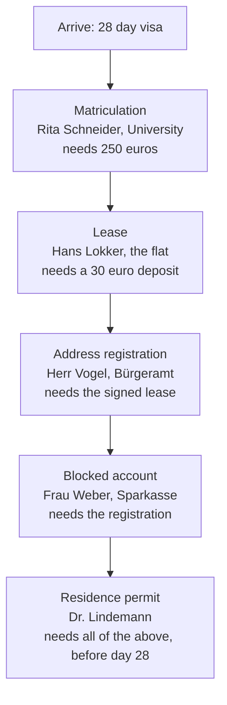

# One Page Design Document

*Far From Home: Kruma Express*. A courier management game with a story, for phones,
played in portrait.

Every number here comes from [CANONICAL_NUMBERS.md](CANONICAL_NUMBERS.md). If they
disagree, that file is right.

## The pitch

You arrive in Lübeck with **20 euros, one suitcase, and 28 days** before your visa
runs out. To stay you need four stamped documents, and each one is locked behind the
one before it. So you take a job at Kruma Express, sort groceries, ride across the
city, and try to get the paperwork done in time.

The tone is the point: **British deadpan humour meeting German municipal precision.**
Every office is immovable. Every rule is real. None of it is on your side.

This is not a language learning game. It teaches nothing.

## The loop

One shift takes about a minute. You always know how you did, because the receipt
itemises it.

## The signature mechanic: the three tier shelf

German nouns have genders and there is no rule to work them out. An apple is
masculine, a banana is feminine, bread is neuter. So of course the warehouse files its
stock by gender.

| Tier | Article | Colour | Shape |
| :--- | :--- | :--- | :--- |
| Top | `das` | Purple | Square (■) |
| Middle | `die` | Pink | Circle (●) |
| Bottom | `der` | Blue | Triangle (▲) |

Three things make this work as a game mechanic and not just a joke:

**You never need German.** Items are labelled in English with the German small and
grey, like `Milk (die Milch)`. You read the tiers by colour and shape.

**It makes you faster, not slower.** Filing by gender cuts the shelf you have to
search by two thirds. The silly rule genuinely helps, which is the second layer of the
joke.

**It is a real gamble.** The tier rail flashes before the item picture appears. Commit
early and guess right and you get **double pay**. Wait for certainty and you get base
pay. That choice is what makes you want another shift.

The picture gets slower across the three stages of Act One: it appears straight away,
then after 1.5 seconds, then after 2.5 seconds. By the third stage the flashing colour
is all you have, and that is when it clicks that purple means `das`.

## The economy

You start on 20 euros and need 250 for the semester fee.

**Pay per shift** is `base + accuracy + streak + tip - damage`. Base pay is
`10 + 3 x shift number`, so the first shift pays 13 euros. Each correct item adds 2.50.
A damaged bag deducts.

**Costs grind at you.** Food is 5 euros a day from day 2. A hostel bed is 8 euros a day
from day 3 until you sign a lease, and signing one costs a 30 euro deposit.

**Five upgrades**, and each one changes a number *and* something you can see:

| Upgrade | Cost | What it does |
| :--- | :--- | :--- |
| E-Bike | 45 | Cuts travel time by 40 per cent |
| Thermal bag | 50 | Halves how fast food goes off while riding |
| Shelf labels | 25 | Stamps the tier shape on every item |
| Pocket notepad | 20 | One free rail re-flash per shift |
| Shift rota cards | 35 | Item pictures arrive 0.8 seconds sooner, bigger early bonus |

## The four documents

This is the real German paperwork chain, in the real order. You cannot skip a step.

The trap is the address registration. You cannot register without your landlord's
signature, and you cannot get a bank account, insurance, enrolment or legal work
without being registered. That is a real catch, not a game invention.

## Win, lose, reset

**Win:** hand the complete set of documents over before day 28.

**Lose:** three strikes, or the visa expires.

**Reset:** start again from the title screen. A session always resolves one way or the
other.

## The screen

Portrait, 390 by 844, fixed. Everything you tap is in the lower part of the screen so
it works with one thumb.

The top strip carries the day count, your money, the tuition bar and the document
tracker. The middle is the 3D view. The bottom is whatever you are doing right now:
the packing list, a dialogue card, the receipt, or the shop.

## How it is built

One HTML file, 3.45 MB zipped, against a 35 MB limit. No network requests at all.
Three.js is kept in a local `vendor` folder.

One music track ships inside the file. Every sound effect is generated while the game
runs. Nobody speaks, so the game plays fine with the sound off.

## Pacing

The first thing you can interact with arrives at **10 seconds**. No menu wall, no
cutscene you cannot skip.

The shelf joke lands properly at about 167 seconds, which is later than the
competition's 90 second guideline suggests. That is deliberate. This is a slow burn
story game, closer to a walking simulator than an arcade game, and the arrival in
Lübeck is what gives the shifts their meaning. See
[THE_MAKING_OF.md](THE_MAKING_OF.md) section 10 for the full reasoning.
