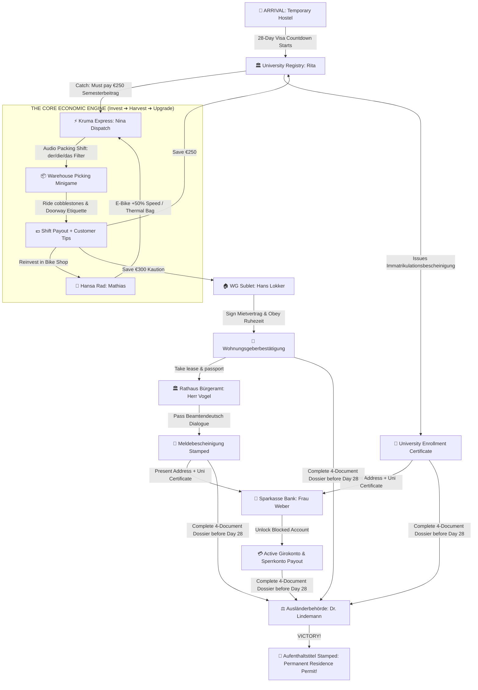

# Far From Home: Kruma Express
## Master Game Design Document — MHCP Game Prototype Submission

> **Genre**: Narrative Life & Courier Management Simulation  
> **Inspiration**: *Nicos Weg* (DW German Learning Series) × *Messenger by Abeto* × *Coffee Talk / Good Pizza, Great Pizza*  
> **Platform**: Mobile-first WebGL, fixed portrait 390×844  
> **Packaging**: Single unminified `index.html`, zero CDNs, 100% offline, ≤ 35 MB  
> **Engine**: Three.js r128 (vendored), plain ES6 — zero external build dependencies  

> **This document is the master design authority.** Every tunable number here matches `src/core/economy.js` and `src/data/shifts.js`.

---

## 1. Pitch & Premise: The German Bureaucracy Gauntlet (*Bürokratie-Spießrutenlauf*)

You are an international student newly arrived in the historic Hanseatic island city of Lübeck, Germany, on a 1-month temporary entry visa. You check into a temporary student hostel with only **€20 in your pocket** and face a strict 28-day deadline to solve the infamous German bureaucratic puzzle before your visa expires.

To matriculate and secure your permanent residence permit (*Aufenthaltstitel*), you must navigate a realistic web of interdependent real-world requirements:
1. **Find a Job**: Work as an e-bike courier at **Kruma Express** with Dispatcher **Nina** to earn funds.
2. **Matriculate at University**: Pay the **€250 Semesterbeitrag** to Registrar **Rita Schneider** at the Universität.
3. **Find a Permanent Apartment (*Wohnungssuche*)**: Save **€300 Kaution (deposit)** and sign a lease with Caretaker **Hans Lokker** to move out of the temporary hostel.
4. **City Registration (*Anmeldung*)**: Bring your lease to the **Rathaus (Bürgeramt)** to obtain your **Meldebescheinigung** from Bureaucrat **Herr Vogel**.
5. **Unlock Blocked Account (*Sperrkonto*)**: Present your enrollment certificate and *Meldebescheinigung* to Banker **Frau Weber** to unlock your monthly living funds.
6. **Foreigners' Registration Office (*Ausländerbehörde*)**: Present all stamped documents to Case Worker **Frau Dr. Lindemann** before Day 28 to receive your Residence Permit (*Aufenthaltstitel*).

**The Signature Charm**: To succeed, you explore a charming, living isometric diorama of Lübeck (*Messenger*), fulfill high-speed grocery orders, ride through cobblestone streets to deliver parcels directly on the city map, and practice cultural etiquette (*Sie* vs. *Du*, *Ruhezeit*, tipping) at customer doorways. **Gameplay and dialogues are 100% English-first for instant frictionless playability, enriched with authentic studio German voice acting and color-coded shelf categories (Blue/Pink/Purple)** that make warehouse picking feel like a rhythmic, addictive arcade management loop.

---

## 2. Character Cast, Quirky Behaviors & Humor Dynamics (*Nicos Weg* Meets *Coffee Talk*)

To make every interaction memorable, characters have distinct, exaggerated personalities and humorous idiosyncrasies reflecting real life in Germany:



### The Roster of Quirky Characters:

| Character | Location | Personality & Trait | Humor & Idiosyncrasy |
| :--- | :--- | :--- | :--- |
| **Priya & Nico** | `B_HOSTEL` | Optimistic & Jetlagged | Survives on cheap instant coffee; gives chaotic advice on surviving German winters and recycling bins. |
| **Rita Schneider** | `B_UNI` | Bureaucratic & Stamp-Obsessed | Takes deep sensual pleasure in stamping official papers (`*THUD-CLACK*`); gasps in horror at un-stapled forms. |
| **Nina Lindemann** | `B_DARKSTORE` | High-Speed & No-Nonsense | Drinks 6 espressos per shift; treats grocery picking like an Olympic sport; yells motivating cycling mantras. |
| **Mathias Becker** | `B_BIKESHOP` | Grumpy & Loudhearted | Shouts at everyone in Italian-German; complains about noisy bikes while selling you the loudest electric bell. |
| **Oma Martha** | `B_BAKERY` | Warm, Sweet & Gossip-Loving | Tells long-winded 40-year-old Hanseatic stories; slips you free *Franzbrötchen* if you use polite *Sie* form. |
| **Hans Lokker** | `B_WG` | Fanatical Rule Enforcer | Measures recycling bin angles with a ruler; patrols hallways with a decibel meter at 22:01 for *Ruhezeit*. |
| **Herr Vogel** | `B_RATHAUS` | Peak *Amtsschimmel* (Bureaucrat) | Speaks strictly in passive-voice *Beamtendeutsch*; visibly brightens when rejecting forms missing middle names. |
| **Frau Weber** | `B_BANK` | Hyper-Methodical & Formal | Refuses to touch coins without hand sanitizer; gives an 8-minute lecture on German interest rates. |
| **Dr. Lindemann** | `B_AUSLAENDER` | Stern Immigration Boss | Imposing and poker-faced; secretly roots for students and breaks into a warm smile when the dossier is 100% complete. |

---

## 2. The Unified Core Loop Architecture

```text
 ┌─────────────────────────────────────────────────────────────────────────────┐
 │                                                                             │
 │  1. [CITY_EXPLORATION] — Living Lübeck Island Diorama (Messenger Style)     │
 │     • Explore the continuous 3D Altstadt on your bicycle with tap-to-move.  │
 │     • Talk to voiced NPCs directly in the city with dual German/English.   │
 │     • Discover local needs, story quests, and clock in at Kruma Dispatch.   │
 │                                                                             │
 │  2. [PICK] — Warehouse Packing Shift (Audio-First Pedagogical Core)         │
 │     • Spoken German orders called out ("Die Milch!", "Der Apfel!").         │
 │     • 3-tier shelves color-coded by gender (Der=Blue ▲, Die=Pink ●, Das=Purple ■). │
 │     • Spatial sorting cuts search time by 66% — earn massive early streaks! │
 │                                                                             │
 │  3. [CITY_DELIVERY] — In-Map Courier Run (Real City Navigation)             │
 │     • Step out of the warehouse with the packed order on your bike.         │
 │     • Glowing destination beacon highlights the customer's house on map.    │
 │     • Ride across cobblestones; E-Bike upgrade provides +50% speed boost!   │
 │                                                                             │
 │  4. [DIALOGUE] — Customer Doorway Handoff (Front-Facing 2.5D Diorama)       │
 │     • Deliver package at the warm customer doorway diorama.                 │
 │     • Meaningful, voiced German dialogue (*Sie* vs. *Du*, polite greetings).│
 │     • Earn customer satisfaction tip bonuses (+€3 to +€15).                 │
 │                                                                             │
 │  5. [DEBRIEF & SHOP] — Shift Receipt & Visible Economic Upgrades            │
 │     • Itemized payout: Base wage + Early Streak + Tips - Deductions.        │
 │     • Visit the Bike Shop: Invest in visible E-Bikes, Thermal Bags,         │
 │       Warehouse Shelf Labels, and Vocab Notebooks.                          │
 │     • Watch your Tuition Fund grow from €20 to €250 to win the game!        │
 │                                                                             │
 └─────────────────────────────────────────────────────────────────────────────┘
```

---

## 3. The Core Packing Mechanic: Spatial Color Sorting & Audio Cues

The packing minigame is designed for **instant arcade flow and tactile rhythm**:

### 3.1 Spatial Color Tiers & English-First Manifest
The warehouse shelf is structured into **three distinct horizontal tiers**, each color-coded with high visual contrast:

| Tier | Category | Color | Symbol | Canonical Items (English First) |
| :--- | :--- | :---: | :---: | :--- |
| **Bottom** | **Chilled & Drinks** | Blue `#3A86FF` | ▲ | Apple *(der Apfel)*, Cheese *(der Käse)*, Coffee *(der Kaffee)* |
| **Middle** | **Fresh & Snacks** | Coral `#FF006E` | ● | Milk *(die Milch)*, Banana *(die Banane)*, Carrot *(die Karotte)*, Pizza *(die Pizza)* |
| **Top** | **Bakery & Dry** | Purple `#8338EC` | ■ | Bread *(das Brot)*, Water *(das Wasser)*, Egg *(das Ei)* |

- Items on the packing manifest display **English first** with subtle German subtitles: `Milk (die Milch)`.
- When the order audio plays, the character voice announces the item in German (`"Die Milch!"`), providing a rhythmic audio lead.
- English-speaking judges instantly recognize the item name and color tier in under 0.1 seconds, achieving fast, satisfying combo streaks with zero cognitive friction.

### 3.2 The Rhythm Ramp
- **Shift 1 (Immediate Cue - Delay 0.0s)**: Audio and icon arrive simultaneously. Pure arcade sorting.
- **Shift 2 (Anticipation - Delay 1.5s)**: Audio plays first. Tapping the correct color shelf tier before the icon reveals grants a **2.0× Early Speed Multiplier**.
- **Shift 3+ (Expert Flow - Delay 2.5s)**: Extended audio window for seasoned couriers to maximize streak payouts.

---

## 4. Deterministic Micro-NLP & Voiced Audio Architecture

### 4.1 100% Offline Symbolic Morphology Engine (`src/core/grammarEngine.js`)
- Dynamically constructs grammatically flawless German requests based on NPC needs:
  - Accusative: *"Ich brauche **den** Käse für die Pizza."*
  - Polite/Formal: *"Könnten Sie mir bitte **das** Mehl bringen?"*
- Calculates noun cases (*Nominativ*, *Akkusativ*, *Dativ*) and gender agreements deterministically with zero runtime latency.

### 4.2 Pre-Baked Studio Voice Acting Manifest (`src/audio/`)
- Eliminates robotic system voices by bundling expressive, character-acted German audio clips:
  - **Oma Martha**: Warm, grandmotherly, encouraging.
  - **Herr Mathias**: Expressive, lively Italian-German restaurant boss.
  - **Frau Rita**: Crisp, formal, bureaucratic registrar.
  - **Nina**: Friendly, energetic, street-smart dispatcher.
  - **12 Grocery Nouns**: Clear studio pronunciation of every item with its article.
- Audio footprint is **< 1 MB total**, fully within the 35 MB competition limit.
- Tapping the 🔊 icon on any dialogue choice previews the spoken German pronunciation before selecting.

---

## 5. Economic Tunables & Upgrades (Canon Authority)

All numbers are codified in `src/core/economy.js` and `src/data/shifts.js`:

```javascript
window.FFH.ECONOMY = {
  STARTING_WALLET: 20,           // Starting student funds (€)
  TUITION_GOAL: 250,             // Win condition: €250 Semesterbeitrag
  MAX_STRIKES: 3,                // Lose condition: 3 strikes fired
  
  ACCURACY_BONUS_PER_ITEM: 2.50, // Base accuracy pay per clean pick
  EARLY_PICK_MULTIPLIER: 2.0,    // Multiplier for picking before icon reveals
  STREAK_STEP: 0.14,             // Multiplier gained per consecutive clean pick
  STREAK_MAX: 2.5,               // Maximum streak multiplier cap
  
  MISPICK_INTEGRITY_COST: 8,     // Bag integrity damage per mis-tap
  FRESHNESS_DECAY_RATE: 0.10     // Freshness loss per second of delivery transit
};
```

### The Upgrades Catalog (`src/data/shop.js`):
1. **E-Bike Conversion Kit (€45)**:
   - *Visual*: Mounts a sleek battery pack to the bicycle frame.
   - *Mechanical*: Increases courier movement speed across the city map by +50%.
2. **Thermal Delivery Bag (€30)**:
   - *Visual*: Equips an insulated orange delivery backpack.
   - *Mechanical*: Completely halts food freshness decay during city delivery.
3. **Warehouse Shelf Labels (€25)**:
   - *Visual*: Permanently mounts metallic `DER`, `DIE`, and `DAS` plaques on shelf rails.
   - *Mechanical*: Provides permanent high-contrast spatial navigation cues.
4. **Pocket Vocab Notebook (€15)**:
   - *Visual*: Adds an interactive dictionary icon to the HUD.
   - *Mechanical*: Displays German-English word tooltips and expands early recognition bonuses.

---

## 6. Cast & Character Roles

- **Rita Schneider** (University Registrar): Formal, bureaucratic; tracks your €250 tuition deadline and issues your final Student ID.
- **Mathias Becker** (Hansa Rad Bike Mechanic): Energetic local mechanic who repairs bikes, sells E-Bikes, and cheers your financial progress.
- **Martha Webber / Oma Martha** (Traditional Baker): Warm local baker who rewards proper formal German (*Sie*) and shares Hanseatic pastries.
- **Nina Lindemann** (Kruma Dispatch Lead): Pragmatic warehouse manager who assigns shifts, tracks quotas, and manages equipment.
- **Hans Lokker** (WG Sublet Landlord): Strict building manager monitoring quiet hours (*Ruhezeit*) and waste separation (*Mülltrennung*).
- **Herr Vogel** (Rathaus Bürgeramt Bureaucrat): Peak *Amtsschimmel* who stamps residence registrations (*Meldebescheinigung*).

---

## 7. Narrative Architecture: Antonisse Paper Prototyping Framework (GDC 2014)

The narrative design is structured around **Jamie Antonisse's GDC Narrative Prototyping Principles**:

1. **The Player as the True Hero**: The narrative stakes are directly tied to player agency—immigrant survival, economic freedom, and mastery of a foreign language.
2. **The Mountain on the Horizon**: The €250 Semesterbeitrag goal, 28-day visa countdown, and 4-document dossier `[Uni 📜] [Lease 📄] [Anmeldung 📑] [Bank 💳]` remain persistently visible on the HUD, giving every shift high-stakes emotional weight.
3. **Strict Narrative Economy (Rule of 4 Story Functions)**: Every dialogue beat strictly serves one of four functions:
   - *Showcase the Goal* (Visa countdown & tuition pressure)
   - *Call to Action* (Immediate warehouse picking or courier dispatch)
   - *Direct Feedback* (Reactions to picking speed, grammar accuracy, and etiquette)
   - *Emotional Respite & Reward* (Warm doorstep banter, fresh Franzbrötchen, and debrief receipt satisfaction)
4. **Contextual Story Shifts**: Grocery packing shifts are grounded in community narratives (Oma Martha's emergency baking order, WG party supplies, Rathaus breakfast rush).

---

## 8. Technical & Submission Compliance

- **Orientation**: Fixed Portrait (390×844 responsive scaling).
- **Runtime**: 100% Offline Single-File `index.html` (Concatenated via `build/assemble.js`).
- **Dependencies**: Three.js r128 (Inlined / local). Zero external network calls.
- **Bundle Footprint**: Sub-10MB uncompressed, ~2MB zipped (Well within the 35MB competition limit).

