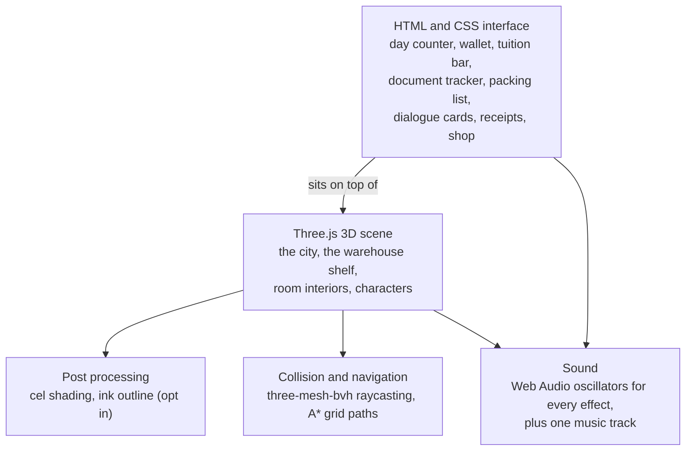
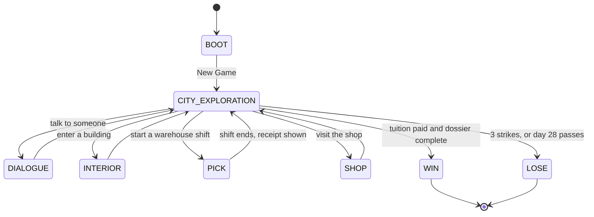

# Technical Reference

How the game is put together. Written for someone opening this repo for the first time.

Numbers live in [CANONICAL_NUMBERS.md](CANONICAL_NUMBERS.md). Story data is explained
in [STORY_FORMAT.md](STORY_FORMAT.md). If a document disagrees with the code, the code
is right and the document is a bug.

## 1. What kind of program this is

One HTML file. You open it and it runs. There is no server, no build step at runtime,
and no network access of any kind.

The whole game is written as plain scripts that hang everything off a single global
object called `window.FFH`. There are no ES modules and no bundler. `build/assemble.js`
reads the file list from `index.dev.html`, glues the source files together in that
order, and writes one `index.html`.

That has one consequence worth knowing: **the code graph tools cannot see most of this
codebase.** Functions are assigned like `window.FFH.doThing = function ..`, which
indexers read as an assignment rather than a function definition. For anything under
`src/core/`, read the file.

## 2. The layers



The interface is ordinary HTML laid over the 3D canvas. This matters when taking
screenshots: capturing the canvas alone gives you the world with no interface on it.

## 3. Phases

The game is a small state machine. One phase owns the screen at a time.



Real phase objects, registered in `src/main.js`:

| Phase | File |
| :--- | :--- |
| `CITY_EXPLORATION` | `src/phases/cityExplorationPhase.js` |
| `PICK` | `src/phases/pickPhase.js` |
| `DIALOGUE` | `src/phases/dialoguePhase.js` |
| `INTERIOR` | `src/phases/interiorPhase.js` |
| `SHOP` | `src/phases/shopPhase.js` |

`BOOT`, `WIN` and `LOSE` are not phase objects. They are screen states that take over
the whole display and hide the interface.

## 4. Where things live

| Folder | What is in it |
| :--- | :--- |
| `src/core/` | Rules with no pictures. Money (`economy.js`), story playback (`storyRunner.js`, `storyActions.js`), pathfinding, character behaviour. |
| `src/phases/` | One file per phase, plus a subfolder for the bigger ones. |
| `src/render/` | Everything that draws. City building, water, trees, rooms, characters, shaders, particles. |
| `src/ui/` | The HTML interface. `hud.js` plus screens for dialogue, modals, shifts. |
| `src/data/` | Content and generated asset blobs. Items, shifts, shop, dialogue, town layout. |
| `src/audio/` | `sfx.js` and `speech.js`. Both generate sound from oscillators. |
| `src/config/` | `gameConfig.js`. Tunable values. |
| `assets/narrative/story.json` | The story. Read [STORY_FORMAT.md](STORY_FORMAT.md) before editing it. |
| `vendor/` | Three.js and three-mesh-bvh, kept local because the rules require it. |

Some files in `src/data/` are large because they hold 3D models converted to text
(`characterGLB.js` is about 6.9 MB). They are generated, not hand written.

## 5. Sound

Every sound effect is generated while the game runs. There are no sound effect files.
`src/audio/sfx.js` makes the beeps and confirmations, and `src/audio/speech.js` makes
the small pitched blips that play while a character talks, in the style of Animal
Crossing.

**One recorded file does ship:** `assets/Music/bgMusic.mp3`, about 939 KB. The build
turns it into a `data:` URI and puts it inside `index.html`, so nothing is downloaded
while playing. The game works with sound off. Nobody speaks, in any language.

Be precise about this in any document. Saying "no audio ships" was true until
7 September 2026 and is now wrong.

## 6. The warehouse shelf

Three shelf tiers, sorted by German grammatical gender, because German nouns have
genders and the joke is that a warehouse would file by them.

| Tier | Article | Colour | Symbol |
| :--- | :--- | :--- | :--- |
| Top | `das` | Purple `#8338EC` | Square |
| Middle | `die` | Pink `#FF006E` | Circle |
| Bottom | `der` | Blue `#3A86FF` | Triangle |

Two things to keep in mind if you touch this:

**The player never needs German.** Items are labelled in English first, with the
German small and grey, like `Milk (die Milch)`. Tiers are told apart by colour and
shape.

**The cue is visual, never audio.** The tier rail flashes before the item picture
appears. Tapping the right tier during that flash pays double. The delay before the
picture appears grows across the three stages of Act One: 0 seconds, then 1.5, then
2.5. By the third stage the flashing colour is the only clue you get, which is where
the game clicks.

## 7. Items and 3D models

Eight food models from the Kenney food kit are bundled: apple, banana, bread, carrot,
carton, cheese, egg, soda bottle. They share one 512 by 512 colour image, stored as a
`data:` URI.

Items the game asks for but has no model for fall back to simple generated shapes, so
the shelf is never empty.

## 8. Checks you can run

| Command | What it does |
| :--- | :--- |
| `node build/assemble.js` | Builds `index.html` from `src/`. Fails if `index.dev.html` and the release file list disagree. |
| `node build/verify.js` | 112 checks on the economy, receipts, story wiring and documents. |
| `node build/check-story.js` | Validates `story.json` and prints the pacing figures. |
| `node build/check-size.js` | Prints the uncompressed size against the 35 MB limit. |
| `node build/package.js` | Builds the submission zip and then inspects the zip it just made. |

Run `assemble` before `verify`. The order that proves a change is safe:

```bash
node build/assemble.js && node build/verify.js && node build/check-story.js && node build/package.js
```

### A note on verifying

When you add a check, break the thing on purpose and confirm the check fails. Several
checks in this suite were written after a bug slipped past a check that could not
have caught it.

## 9. Things that have gone wrong before

Text search reports this codebase as healthy when it is not. `hideDialogueBox` was
called in two places and defined in none. `playSfx('wrong')` had six call sites and no
implementation. `grammarEngine.js` had no callers at all and still shipped, and it has
since been deleted, although this document described it for weeks afterwards.

Searching for a name finds the name. It does not tell you whether anything answers.
