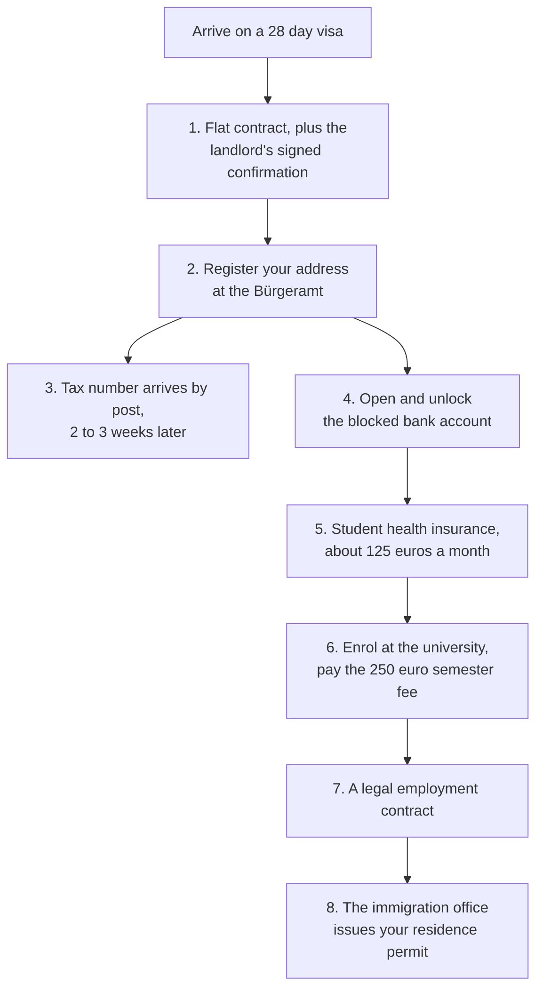
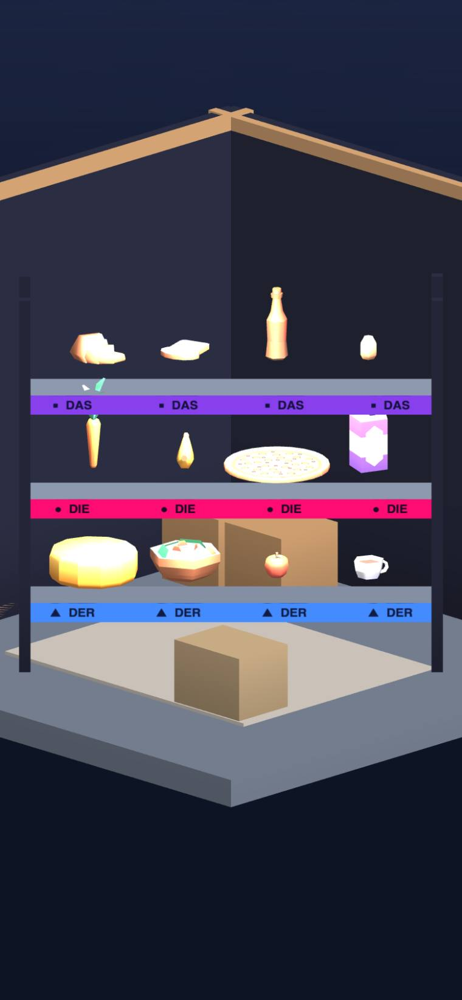
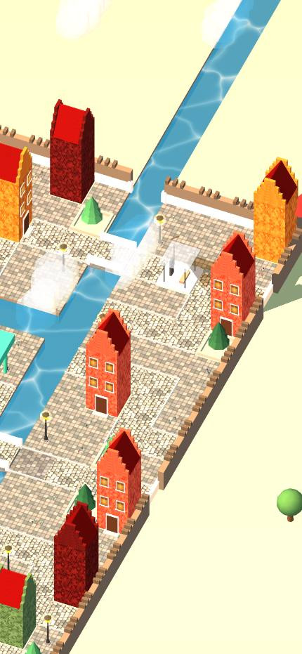
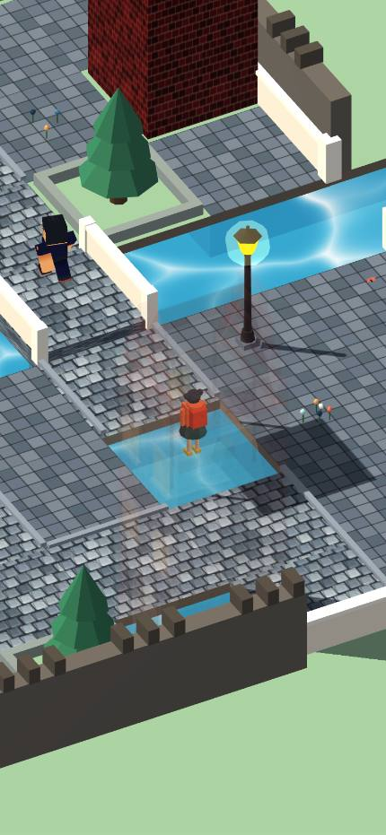

# The Making of *Far From Home: Kruma Express*

How this started as a game you played by speaking German into a microphone, and ended
up as a game about paperwork.

This is the story of the project: where the idea came from, why it had to change, how
real German rules turned into game mechanics, what broke, and what we did about it.

It is not the place to look up design details or numbers. The design is in
[README_HACKATHON.md](README_HACKATHON.md), the numbers are in
[CANONICAL_NUMBERS.md](CANONICAL_NUMBERS.md), and the session by session record is in
[submission/BUILD_LOG.md](submission/BUILD_LOG.md). Where this document and the code
disagree, the code is right.

## 1. Where it started

The first version of this game was called *Kruma*, and it was a different game.

*Kruma* was pitched to an earlier Meta Horizon competition as a quiet 2D game about
running a small refuge in Germany. Travellers came in, you looked after them, and the
place slowly warmed up around you. It had a full set of design documents: a design
document, a player journey map, a production plan, a visual concept package, a pitch
video, and concept art.

One rule was the whole product:

> **No translations, ever.** A visitor arrives and speaks to you in German. You get no
> text translation. You work out what they need from what you can see, things like
> steam for heat or shivering for cold, and then you answer by **speaking German into
> the microphone.**

Everything grew from that. Speaking correctly earned you Trust Fragments, which you
spent on fixing up the place, and the art warmed from cold grey line drawings into
watercolour as you succeeded. There was a spaced repetition schedule on a 1, 4, 7 day
curve. There was a system where a character never told you that you were wrong, but
repeated your sentence back correctly while staying in character:

> **You say:** *"Ich fahre mit die U-Bahn."*
> **They reply:** *"Ja, wir fahren **mit der U-Bahn**! Der Zug kommt in zwei Minuten."*

There was a full curriculum built on the official European language levels, four
chapters from greetings up to office conversations, and a mode where you replayed a
chapter as the visitor instead of the host.

**And all of it needed a language model.** The plan was clear. Run a model on a server
for the first version to keep replies under a quarter of a second, then later put a
small model on the phone itself so it could work offline.

That was a reasonable plan. It is also exactly the plan the new competition rules make
impossible.

## 2. Why it could not survive the rules

This competition asks for one self contained web build. Four of its packaging rules
each kill a voice game on their own.

| The rule | What it does to *Kruma* |
| :--- | :--- |
| One zip file, 35 MB maximum, `index.html` at the top | There is no room for a speech model of any size. |
| **No network access.** Anything loaded from an outside address fails validation | The server plan is gone. |
| Every asset must be inside the zip | You cannot download a model on first run either. |
| It runs in a browser | No phone specific runtime, no dedicated chip to run a model on. |

Speech recognition needs either a server or a model on the device. Rule two removes the
server. Rule one removes the model.

**How big is the gap?** We can answer that from this project, because the submission
video needed text to speech and we actually installed it and measured it. Kokoro is a
small, compressed speech model, and turning text into speech is the *easier* half of
the problem. Its dependencies came to **496 MB**:

| Package | Size |
| :--- | :--- |
| onnxruntime-node | 208 MB |
| huggingface transformers | 136 MB |
| onnxruntime-web | 91 MB |
| kokoro-js | 29 MB |
| everything else | about 32 MB |

That is **more than fourteen times the entire budget for the game**, for the easier
half of the job, before any of the game exists. The finished game, zipped, is
**3.45 MB**. A small chat model at 4 bit precision is around 1.5 GB, roughly **430
times** the size of what we shipped.

The voice idea was not dropped because it was hard. It was **impossible inside the
rules**, and no amount of clever engineering closes a gap that size.

## 3. The pivot

The first attempt at a fix was the wrong one. Keep the language learning idea, drop
the voice, let people type or tap the answer instead.

We built that on 1 September and killed it the same day.

The reason is simple. **A language learning game that cannot hear you is not a
language learning game.** It is a vocabulary quiz in a costume. We would have been
advertising something we could not deliver, and the competition scores focus and
punishes games that sprawl.

So we cut the claim instead of faking it. Every document we hand in now says this
plainly:

> This is not a language learning game. It teaches nothing and asks you to remember
> nothing. All play is in English. German is scenery.

What survived was not the mechanic. It was the **feeling**. The player we originally
had in mind was someone nervous about speaking, who feels out of their depth against a
system that will not slow down for them. That is still exactly who this game is for.
The thing that will not slow down just changed. It used to be a native speaker. Now it
is a government office.

| *Kruma*, June 2026 | *Kruma Express*, September 2026 |
| :--- | :--- |
| 2D watercolour refuge | 3D Lübeck, portrait, in a browser |
| Speak German into a microphone | Tap to move, sort with one thumb |
| No translations, ever | **English first**, German as scenery |
| Model on a server, then on the phone | **No network at all**, 3.45 MB zipped |
| Trust Fragments fix up the café | Wages take you from 20 euros to 250 |
| A full language curriculum | **No curriculum.** A filing joke |
| Subscription and ads | No monetisation. It is a prototype |
| Warm and forgiving | **Deadpan.** Every office is immovable |

We kept the word *Kruma* on purpose. It is the courier company you work for now. Same
idea, different job.

## 4. The research that became the game

The new version needed something to push against, and it was already sitting in the
research folder.

[GERMAN_EXPATS_LIVING_RULES_AND_LAWS.md](GERMAN_EXPATS_LIVING_RULES_AND_LAWS.md) was
written as background for the old game, so that characters would not say things about
German life that were not true. Read as a design document instead of as background, it
turns out to describe **a locked chain of dependencies with a deadline attached.**
Nobody had to invent a villain.

### The chain

You cannot do these things in whatever order suits you. Each one is locked behind the
one before it.

The trap is step 2. **You cannot register your address without your landlord's
signature, and you cannot get a bank account, insurance, enrolment or legal work
without being registered.** A contract on its own is not enough. And the whole chain
has to be finished before a 28 day visa runs out.

That is the game. The four document tracker and the day counter in the corner of the
screen are that chain. None of it is made up, and that is exactly why it is funny.

### Rules that became mechanics

Each of these is a real law or custom doing a job in the game:

| The real rule | What it does in the game |
| :--- | :--- |
| Students may work 20 hours a week at most, or they lose student status | The cap that stops "just do another shift" being the answer to everything |
| The semester fee is 250 to 350 euros, and is not tuition | The 250 euro target the whole economy points at |
| The blocked account holds about 11,000 euros but pays out only 934 a month | Something you have to unlock, not a pot of money you can spend |
| You must register your address within 14 days, with the landlord's confirmation | The registration objective, locked behind the lease |
| Bottles carry a deposit, 25 cents on single use and 8 to 15 on reusable | Bottles you pick up in the street, itemised on your receipt |
| Quiet hours start at 22:00, and last all day Sunday | Deliveries that go wrong if you are loud at the wrong time |
| Waste goes in four separate bins, and glass is sorted by colour | A sorting scene, played completely straight |
| Leases require you to air rooms fully two or three times a day | A household ritual, treated with total seriousness |
| You use the formal *Sie* until someone offers you *Du* | Manners at every doorstep, which move your tip |
| Cash work pays 8 euros an hour against 13.50 legal, with no insurance | The tempting bad offer, shown as the risk it is |
| Riding without a ticket costs 60 euros | A real cost, not a cartoon penalty |

The comedy works because none of it is exaggerated. Only one half of the joke is a
joke. The offices are accurate. The narrator is the one being funny about them.

## 5. The one joke that became the mechanic

German nouns have genders, and there is no rule you can work out. An apple is
masculine. A banana is feminine. Bread is neuter. You simply have to know.

So of course the warehouse files its stock by gender.

| Tier | Article | Colour | Shape |
| :--- | :--- | :--- | :--- |
| Top | `das` | Purple | Square (■) |
| Middle | `die` | Pink | Circle (●) |
| Bottom | `der` | Blue | Triangle (▲) |

*From the game. Three colour coded tiers with the items on them.*

Three things turn that into a mechanic rather than a gag.

**You do not need to understand it.** Items are labelled in English with the German
small and grey, like `Milk (die Milch)`. You read the tiers by colour and shape. The
game never asks you to remember anything.

**It makes you faster.** Filing by gender cuts the shelf you have to search by two
thirds. The absurd rule genuinely helps, which is the second layer of the joke and the
reason it stays funny when you do it fifty times.

**It is a real gamble under time pressure.** The tier rail flashes before the item
picture appears. Commit to a tier during that flash and you get **double pay**. Wait
until you are certain and you get base pay. That is a genuine choice, and it is what
makes you want one more shift.

The difficulty comes entirely from *when* you find out what the item is. The picture
appears straight away in the first stage, after 1.5 seconds in the second, and after
2.5 seconds in the third. By the third stage the name arrives last, so the flashing
colour is all you have. That is the moment it clicks: **purple means das**, learned by
playing rather than by being told.

This is also the only place the game is about German at all, and it is about German
the way a filing cabinet is about the alphabet.

## 6. What the game actually is

*The city, generated by code: stepped gable houses, cel shaded canal water, cobbled
streets, town wall.*

You arrive with **20 euros, one suitcase and 28 days.** You cycle around a 3D city,
pack grocery orders against a clock, hand them over at doors where being too formal or
too familiar changes your tip, and spend what you earn.

The engine underneath is: **spend, earn, upgrade, watch it grow.** Five upgrades each
change a number and something you can see:

| Upgrade | Cost | What it does |
| :--- | :--- | :--- |
| E-Bike | 45 | Cuts travel time by 40 per cent |
| Thermal bag | 50 | Halves how fast food goes off |
| Shelf labels | 25 | Stamps the tier shape on every item |
| Pocket notepad | 20 | One free rail re-flash per shift |
| Shift rota cards | 35 | Pictures arrive sooner, bigger early bonus |

Against that, costs grind: 5 euros of food a day from day 2, an 8 euro hostel bed from
day 3 until you have a lease, a 30 euro deposit when you sign one. And behind every
shift sits the paperwork, ticking off in the corner of the screen.

Under the hood: one HTML file, **3.45 MB zipped** against a 35 MB limit, **no network
requests at all**, fixed portrait at 390 by 844, Three.js kept locally, grid
pathfinding, optional ink outlines, room interiors. One music track ships inside the
file. Every sound effect is generated while the game runs, so it plays fine muted.

## 7. How it was built

Every session was done by prompting an AI coding agent, Claude, through Claude Code.
The agent wrote the city generation, the navigation, the money and receipts, the
sorting mechanic, the story playback, the interface, and the build scripts that glue
the source files into one HTML file.

The human work was three things: **deciding** what to build, cut and undo,
**playtesting** and reporting what looked wrong, and **small tuning** of numbers and
the occasional one line fix.

The shape of 110 commits:

| When | What happened |
| :--- | :--- |
| 21 Aug | First playable slice. The loop existed, with no city and nothing to watch grow. |
| 28 Aug | The busiest day. City loop, collision, **the economy and visible upgrades**, first packaging. Browser text to speech built and cut, because it sounded like a screen reader. |
| 29 Aug to 1 Sep | Narrative research, then the **switch to English first**. |
| 2 Sep | 35 commits, nearly all 3D. Textures, the canal water shader, the hand drawn map, countryside, town walls, **grid pathfinding**. |
| 3 to 4 Sep | The written story turned into playable scenes, deliberately in chunks. |
| 5 Sep | Character rigging and atmosphere bugs. The end of day screen redesigned. |
| 6 Sep | The honesty pass. Every hollow feature deleted from the documents. |
| 7 Sep | Progression blockers fixed, the day end ritual added. **The skill tree cut.** |
| 8 Sep | Receipt correctness, more tests, art and camera polish, packaging. |

Session by session detail, including which work was the agent's and which was by hand,
is in [submission/BUILD_LOG.md](submission/BUILD_LOG.md).

## 8. What broke

The interesting failures were not graphics bugs. They were places where the project
believed something untrue about itself.

### The receipt that paid twice

The function that ends a shift credits your wallet, moves the day forward and charges
your daily costs. It had no guard against running twice, and it had exactly one caller:
the button that dismisses the receipt. **Double tapping that button ran the whole day's
settlement twice.**

The fix has a detail worth remembering. The guard has to key off the payout itself, not
off the day and shift number, because ending a shift changes both of those. A second
call would have looked like a brand new day and settled again. We made that mistake
and the new tests caught it before it shipped.

### The receipt that hid your money

Money earned walking around on day one was worked out as "wallet now, minus what you
started with". That quietly showed **zero as soon as you bought anything**, hiding
money you really had earned. Replaced with an actual counter.

### The shortcut that faked a fix

Chasing the 90 second guideline, we pointed the quick start link straight at the third
shift so a reviewer would hit the good bit immediately. **We undid it the same day.**

Jumping there also set the shift number to three, and pay is looked up by shift number,
so a reviewer's first screen was titled after the wrong shift and paid the wrong wage,
19 euros instead of the 13 every document quotes.

The wrong numbers were the smaller problem. **The good bit *is* realising that purple
means das**, and you only realise it because the first two stages taught you without
saying so. Dropped straight into the hardest stage, a reviewer sees a flashing colour
that was never explained. It satisfied the stopwatch by skipping the game. And the
pacing tool still reported the same 167 seconds afterwards, so it did not even buy the
number it cost us the experience for.

We kept the ability to jump to a stage and changed which stage. Six tests now hold that
in place, because the old test suite built its own game state instead of going through
the real entry point, so it could never have caught this.

### The claim that drifted

Every document we hand in said "no audio ships". That was true when we decided it on
2 September, and false from 7 September, when a music track was added and nobody
updated the documents.

The packaging was always fine. The music is written into `index.html` as text, so
nothing is ever downloaded. But the sentence was wrong for a day. We found it on
8 September while checking whether the music folder was dead code, and fixed it
everywhere. Worth recording because the checklist had a note telling future sessions
not to let this claim drift, and it drifted in the direction the note did not expect.

### Files that contradicted the project

A cleanup pass removed 108 files, about 21 MB, from version control. The notable find
was **81 unused voice recordings** left over from the voice era. The game never used
them, but they made "no voice acting" look like a lie to anyone who opened the folder.

The ignore file turned out to be saved in the wrong text encoding for its last two
rules, so those rules matched nothing and three folders it claimed to ignore were being
tracked anyway.

### Why searching the code is not enough

This codebase has hidden real bugs from text search more than once. One function was
called in two places and defined in none. A sound effect had six call sites and no
implementation. A whole grammar file had no callers at all and still shipped, and the
technical reference described it for weeks after it was deleted.

Searching for a name finds the name. It does not tell you whether anything answers.

## 9. What we cut

Depth over breadth was a rule, and it cost real work:

| Cut | When | Why |
| :--- | :--- | :--- |
| Voice input, the whole original idea | Aug | Impossible inside 35 MB with no network |
| Browser text to speech | 28 Aug | Sounded like a screen reader, not a character |
| The language learning framing | 1 Sep | A promise the game could not keep |
| Spaced repetition, vocabulary list, quiz | 6 Sep | Advertised, but hollow |
| The pocket notepad, as it then was | 6 Sep | Listed as an upgrade while its button never appeared |
| The adaptation skill tree | 7 Sep | A menu of numbers you could not feel, which is the exact trap the brief warns about |
| 81 voice recordings | 8 Sep | Dead, and contradicted what we were claiming |

The rule that made these easy: **if it is not in the game, it does not go in a document
we hand in.** And if it is in the game but the player cannot feel it, it is clutter.

## 10. Where it stands, and where it goes

### Status

Done and checked: a playable Act One that resolves into win, lose or reset, the
submission zip at 3.45 MB with no outside requests, the design intent document, and the
build log. The test suite passes 112 checks.

### On the 90 second guideline

The pacing tool reports the shelf joke landing at **167 seconds against a 90 second
budget**, and that is a decision rather than an unfinished job.

The 90 second idea suits games where the mechanic is the whole experience, something
you should be inside immediately. This is a **slow burn story game**, closer in pace to
a walking simulator than a score chase. Arriving in Lübeck is not a delay in front of
the game. **It is where the game explains itself.** It is where the humour lands, where
20 euros starts to feel like very little, and where the 28 day clock starts to matter.
Cut it down to fit a stopwatch and the warehouse becomes a colour matching game with no
reason to care who is sorting the shopping or why.

Two things matter more than that headline number, and both are true:

**You are playing almost immediately.** The first thing you can interact with is at
**10 seconds**, and the door buzzer at 18. No menu wall, no cutscene you cannot skip,
no studio logo. That is what the engagement criterion is really asking for. The 167
seconds is not "time before the game starts". It is time before one particular payoff.

**That payoff has to be earned to exist.** Realising purple means `das` only happens
because the first two stages taught it without saying so. Handed to you at 30 seconds,
it is not a realisation. It is a tooltip.

We tested this rather than assuming it. The shortcut described in section 8 hit the
stopwatch exactly and made the game measurably worse. **We optimised for the metric and
it backfired**, which is the strongest evidence we have that the metric is the wrong
tool for this kind of game.

So the tooling still measures and prints the number. Nothing was retuned, hidden or
made to pass. The quick start link exists for reviewers who want the mechanic straight
away, and it drops them on **stage one**, where the mechanic is taught, not on the
ending.

### Where it goes

**Finish the curve.** All 28 days instead of Act One, each with its own office to get
past. The paperwork chain is already the skeleton. What it needs is the middle.

**The economy has room left**, and none of it needs inventing, because it is already in
the research document. Rent tiers and the deposit held in escrow. Flatmates who each
owe a share of the broadcast fee. The tax number arriving by post two or three weeks
after you register, and costing you emergency tax rates until it does. The 60 euro fine
for riding without a ticket. A bike that breaks when you cannot afford it to. The 20
hour work limit only becomes a real constraint once there are enough days for it to
bite.

**The filing joke extends on its own.** Plural and dative shelves are the same idea one
level up, a fourth rail, and it arrives exactly when three has stopped being funny.

**And the original idea is not dead.** Everything that made voice impossible here comes
from this competition's packaging rules, not from the idea itself. On a platform that
allows a real runtime and a model on the device, the refuge game and its no
translations rule become buildable again. What this project shows in the meantime is
that the feeling underneath it, being out of your depth against something that will not
slow down, does not need speech recognition at all. A government office will do.

## Where to look next

All of these are in this repository:

| What | Where |
| :--- | :--- |
| The German law and culture research | [GERMAN_EXPATS_LIVING_RULES_AND_LAWS.md](GERMAN_EXPATS_LIVING_RULES_AND_LAWS.md) |
| The design | [README_HACKATHON.md](README_HACKATHON.md) |
| Every number | [CANONICAL_NUMBERS.md](CANONICAL_NUMBERS.md) |
| The design on one page | [ONE_PAGE_DESIGN_DOCUMENT.md](ONE_PAGE_DESIGN_DOCUMENT.md) |
| How the code fits together | [TECHNICAL_REFERENCE.md](TECHNICAL_REFERENCE.md) |
| The story file format | [STORY_FORMAT.md](STORY_FORMAT.md) |
| Session by session record | [submission/BUILD_LOG.md](submission/BUILD_LOG.md) |
| Why each design decision was made | [MASTER_RESOURCES_AND_DECISION_ARCHIVE.md](MASTER_RESOURCES_AND_DECISION_ARCHIVE.md) |

The original *Kruma* documents, and this project's retired drafts and video pipeline,
are kept privately outside the repository.
