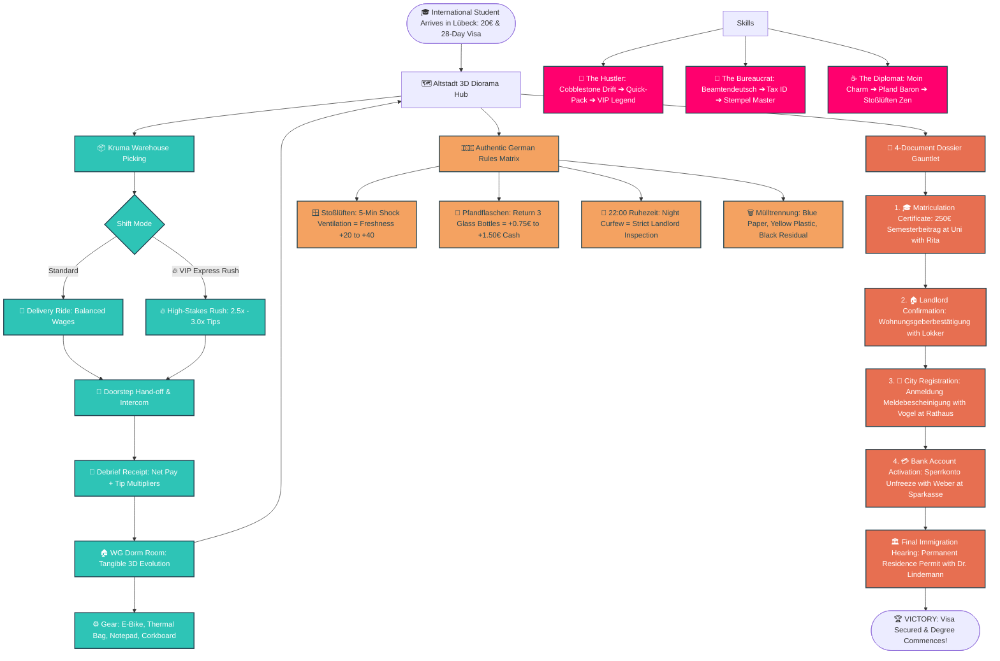
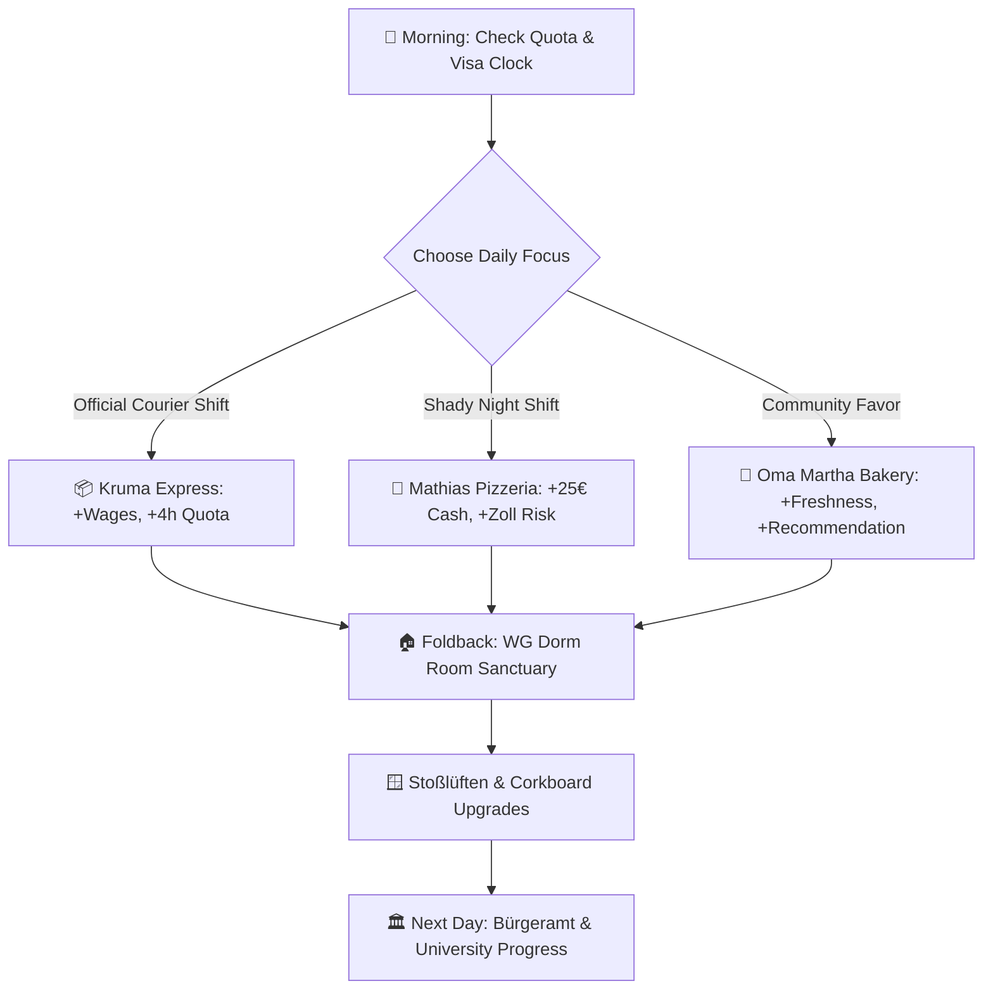

# Far From Home: Kruma Express — Game Mind Map & Narrative Character Design Authority

> **Authority Document**: This document serves as the master systemic mind map, narrative decision tree, and character interaction guide for *Far From Home: Kruma Express*. Every update to code, skills, or dialogue must be reflected here.

---

## 1. High-Level Game Systemic Mind Map



---

## 2. Character Narrative Design & Interaction Matrix

| Character | Location | Voice & Tone | Alignment & Role | "Who Speaks What, When & What You Do" | Tangible Reward |
| :--- | :--- | :--- | :--- | :--- | :--- |
| **Rita Schneider** | University (`B_UNI`) | Sine (310Hz)<br>*Maternal & Orderly* | University Registrar | • **Day 1**: Explains the 250€ *Semesterbeitrag* & prompts Strategy Choice (Hustler / Diplomat / Scholar).<br>• **Deep Story**: Shares her daughter studying abroad in Tokyo.<br>• **Goal**: Accept 250€ fee and grant official *Immatrikulationsbescheinigung*. | 🎓 **Matriculation Certificate** (Unlocks Bank & Visa steps) |
| **Nina Lindemann** | Dark Store (`B_DARKSTORE`) | Triangle (340Hz)<br>*Pragmatic & Street-Smart* | Kruma Dispatch Lead | • **Shift Start**: Choose between **Standard Shift** or **🔥 High-Stakes VIP Express Rush**.<br>• **Lore**: Explains her 80 km/day backstory to pay tuition and fight for fair rider treatment.<br>• **Shortcuts**: Reveals alley behind St. Mary’s Church. | 🚴 **Shift Dispatch** & 2.5×–3.0× Tips |
| **Hans Lokker** | WG Dorm (`B_WG`) | Sawtooth (160Hz)<br>*Gruff Caretaker* | Landlord & Caretaker | • **Encounter**: Enforces 22:00 *Ruhezeit* and no shoes in hallways.<br>• **Emotional Moment**: Talks about his late wife Anna and church bells.<br>• **Quest Action**: Accept warm Butter Croissant bribe from Bakery Hansa. | 📜 **Landlord Confirmation** (*Wohnungsgeberbestätigung*) |
| **Nico** | Hostel (`B_HOSTEL`) | Triangle (265Hz)<br>*Helpful Expat Senior* | Student Roommate | • **Survival Lore**: Shares the 3 golden rules of surviving your first month.<br>• **Interactive Action 1**: Return empty Club-Mate *Pfand* bottles.<br>• **Interactive Action 2**: Practice 5-minute *Stoßlüften* in dorm room.<br>• **Emotional Beat**: Sunday 2-hour phone calls home to family. | 🍾 **+0.75€ to +1.50€ Cash**<br>🌬️ **+20 to +40 Freshness** |
| **Martha Webber (Oma)** | Bakery Hansa (`B_BAKERY`) | Sine (215Hz)<br>*Warm Grandmother* | District Heart | • **Food Purchase**: Sourdough bread (+10 Freshness) & Franzbrötchen.<br>• **Sidequest**: Sells warm butter croissant for 2.00€ to soften Hans Lokker.<br>• **Emotional Moment**: Story of rebuilding Lübeck post-war through mutual aid. | 🥐 **Butter Croissant Item** & Morale Boost |
| **Mathias Becker** | Pizzeria (`B_PIZZA`) | Sawtooth (175Hz)<br>*Passionate Artisan* | Chef & Bike Mechanic | • **Food Purchase**: 8.00€ stone-baked Pizza Margherita (+20 Freshness).<br>• **Immigrant Story**: Arrived from Naples in 1994 with 50 Marks.<br>• **Diplomacy**: Form a truce over outdoor terrace bike parking. | 🍕 **20% Food Discount** & +25 Relationship |
| **Herr Vogel** | Bürgeramt (`B_RATHAUS`) | Square (200Hz)<br>*Pedantic Official* | Municipal Registrar | • **Requirement**: Demands Passport + signed *Wohnungsgeberbestätigung* from Lokker.<br>• **Philosophy**: Explains why stamped forms protect democratic rights against arbitrary power.<br>• **Action**: Double-stamps municipal registration certificate. | 📑 **Meldebescheinigung** (City Registration Certificate) |
| **Frau Weber** | Sparkasse (`B_BANK`) | Sine (290Hz)<br>*Methodical Banker* | Bank Advisor | • **Requirement**: Demands Matriculation Certificate + Meldebescheinigung.<br>• **Action**: Unlocks German Girokonto & activates blocked account (*Sperrkonto*).<br>• **Wisdom**: Reinvest wages early into tools that save courier time. | 💳 **Sperrkonto Activated** (+50€ Monthly Disbursement) |
| **Dr. Lindemann** | Ausländerbehörde (`B_AUSLAENDER`)| Sine (250Hz)<br>*Stern & Fair Director* | Immigration Director | • **Check**: Audits complete 4-document dossier.<br>• **Verdict**: Validates resilience and grants permanent *Aufenthaltstitel* (Game Win). | 🏆 **VICTORY**: Residence Permit Granted |

---


```
                                             │
      ┌──────────────────────────────────────┼──────────────────────────────────────┐
      ▼                                      ▼                                      ▼
[🚴 THE HUSTLER]                       [📜 THE BUREAUCRAT]                    [☕ THE DIPLOMAT]
Tier 1 (1 SP): Cobblestone Drift       Tier 1 (1 SP): Beamtendeutsch Decoded  Tier 1 (1 SP): Northern "Moin" Charm
➔ +25% Bike Speed on Cobblestones      ➔ Unlocks AStA +25€ Bursary            ➔ -20% Shop & Food Costs
      │                                      │                                      │
Tier 2 (2 SP): Quick-Pack Vision       Tier 2 (2 SP): Steuer-ID Exemption     Tier 2 (2 SP): Pfand Baron
➔ +3.0s Grace Picking Timer            ➔ +15% Net Shift Wages                 ➔ Double Bottle Returns (1.50€)
      │                                      │                                      │
Tier 3 (3 SP): VIP Rush Legend         Tier 3 (3 SP): Stempel Master          Tier 3 (3 SP): Stoßlüften Zen
➔ Guaranteed 3.0x VIP Tips             ➔ Auto-Approves Missing Checks         ➔ Stamina Decays 50% Slower (+40 Fresh)
```

---

## 4. The German Chaos & Cultural Rules Matrix

*(Derived strictly from the Master Authority Document: `Docs/GERMAN_EXPATS_LIVING_RULES_AND_LAWS.md`)*

1. **The 20-Hour Rule & Employment Law (§16b AufenthG)**:
   - International students are legally capped at **20 hours per week**.
   - Primary official contract (Kruma Express) logs registered tax hours.
   - Off-the-books side cash gigs (Mathias's Pizzeria / Oma's Bakery) pay below minimum wage (8€/hr) in envelope cash (*Schwarzgeld*), ignoring the 20h quota but raising **Zoll / Ordnungsamt risk**.

2. **The 4-Document Sequential Dependency**:
   - You *cannot* unlock your **Sperrkonto (Bank)** without **Anmeldung (Bürgeramt)**.
   - You *cannot* do **Anmeldung** without **Wohnungsgeberbestätigung (Landlord Lokker)**.
   - You *cannot* finalize **Visa (Dr. Lindemann)** without all 4 documents + Tuition cleared.

3. **Statutory Health Insurance & Semesterticket**:
   - Matriculation requires statutory student health insurance (TK/AOK at 125€/mo).
   - Paying the 250€ Semesterbeitrag unlocks the regional **Semesterticket**, preventing 60€ *Schwarzfahren* fines.

4. **Daily Micro-Actions**:
   - **Pfand Recycling**: Interacting with Nico yields instant grocery cash (0.25€ single-use / 0.15€ glass).
   - **Stoßlüften**: 5-minute room shock ventilation prevents mold penalties from Lokker and restores Freshness.
   - **22:00 Ruhezeit**: Ending shifts late requires quiet, polite customer interactions to avoid noise penalty deductions.
   - **Punctuality & Etiquette**: Doorstep greeting choices determine whether you receive generous cash tips (+15€) or noise/attitude deductions (-4€).

---

## 5. Master Verification Scale for AI Agents

Before writing code or editing game narrative, every AI agent MUST evaluate against this scale:
- [ ] **20-Hour Quota Check**: Does this respect the weekly 20h student limit or frame excess as *Schwarzarbeit*?
- [ ] **Document Order**: Does the quest chain follow the strict sequential dependency (Lease ➔ Anmeldung ➔ Bank ➔ Uni ➔ Visa)?
- [ ] **Cultural Authenticity**: Are authentic German terms used properly (*Stoßlüften*, *Ruhezeit*, *Pfand*, *Mülltrennung*, *Beamtendeutsch*)?
- [ ] **Economic Sanity**: Do wages (€13.50 legal vs. €8.00 cash), fines (€60 Schwarzfahren), and costs (€250 Semesterbeitrag) match canonical German realities?
- [ ] **Build Integrity**: Run `node build/assemble.js` and `node build/check-size.js` to ensure the build remains `< 35 MB` and 100% offline airgapped.

---

## 6. The Schell × Ingold Narrative Architecture (Living Systems & Narrative Atoms)

### A. Jesse Schell's 15 Properties of Living Order applied to *Far From Home*
1. **Levels of Scale**: Macro (28-day visa & 250€ tuition) $\rightarrow$ Meso (Daily shifts, Bürgeramt visit) $\rightarrow$ Micro (3s shelf pick, doorstep buzzer).
2. **Strong Centers**: The WG Dorm Sanctuary (emotional anchor), Marktplatz (spatial anchor), Kruma Dark Store (economic anchor).
3. **Boundaries as Thresholds**: The Doorstep Intercom & Buzzer—transforming public street cycling into intimate, high-stakes customer dialogue.
4. **Alternating Repetition**: High-adrenaline courier picking & rush cycling alternated with peaceful room respite, tea, and *Stoßlüften*.
5. **The Void & Inner Calm**: The 5-minute *Stoßlüften* window moment where cathedral bells chime and Freshness regenerates.
6. **Non-Separateness**: The student character organically evolves from an alienated outsider with €20 into a recognized, beloved member of the Lübeck community.

### B. Jon Ingold's Narrative Sorcery & Defensive Logic
1. **Encounters over Linear Quests**: The player can roam Lübeck in any order; dialogue queries world state rather than locking into rigid trees.
2. **Narrative Atoms with Preconditions**: Dialogue blocks only surface when preconditions are satisfied (e.g. Herr Vogel only double-stamps if the lease confirmation is signed).
3. **State-Dependent Character Reactivity**:
   - **Rita Schneider**: Reacts with urgency and maternal excitement when wallet $> 200€$ (close to tuition).
   - **Hans Lokker**: Sniffs woodsmoke/dough when the player takes unrecorded night shifts at Mathias's pizzeria.
   - **Dr. Anke Schmidt**: Audits player's 20-hour weekly work meter and advises on student labor protections.
4. **Organic World Blockers**: No artificial invisible walls—blockers are real German laws (§16b AufenthG 20h cap, missing Anmeldung, Sparkasse prerequisites).

---

## 7. The Inkle / Meg Jayanth Narrative Engine (*80 Days* Integration)

1. **4-Resource Tension Engine**:
   - **Time**: 28-Day Entry Visa deadline countdown.
   - **Money**: €20 initial wallet $\rightarrow$ €250 Tuition Target.
   - **Labor Quota**: 20-Hour Weekly Work Limit (§16b AufenthG).
   - **Freshness / Stamina**: Physical well-being restored by *Stoßlüften*, food, and proper sleep.
2. **"Leading the Player Astray" (Meg Jayanth)**:
   - Tempting side-stories: Mathias's off-the-books night pizza cash run, Klaus's cobblestone speed race, Oma Martha's 5 AM hospital delivery.
3. **NPCs with Agency**:
   - Hans Lokker grieves his late wife Anna; Rita remembers her daughter alone in Tokyo; Mathias fights for traditional handmade food.
4. **Expressive Player Persona**:
   - Choices define whether you navigate Germany as **The Hustler** (*fast, ambitious*), **The Bureaucrat** (*legalistic, methodical*), or **The Diplomat** (*warm, community-focused*).

---

## 8. Extra Credits: The Three Pillars of Game Writing & Mechanics-First Design

1. **Plot**: External systemic pressure (28-day visa, 250€ tuition, 4 sequential dossier certificates).
2. **Character**: Internal motivations, vulnerabilities, and cultural friction.
3. **Lore**: Authentic Hanseatic brick gothic history, *Beamtendeutsch*, *Ruhezeit*, *Stoßlüften*, and *Mülltrennung*.
4. **Design Mechanics First**:
   - Verbs come first (Steering, Sorting, Budgeting).
   - The narrative directly comments on the player's physical and economic gameplay state.

---

## 9. Design Doc: Diamond Foldback Indie Branching Architecture



1. **The Diamond Fold**: Meaningful divergence during the day converging back to the WG Dorm sanctuary at night.
2. **Invisible Variable State Tracking**: Using lightweight numeric state tags (`zollRisk`, `semester`, `weeklyHoursWorked`, `npcRelationships`) to alter all NPC reactions without building separate 3D levels.

---

## 10. The 20-Resource Master Taxonomy & Architectural Synthesis

```
                               THE UNIFIED GAME ARCHITECTURE
                                              │
       ┌───────────────────────────────┬──────┴────────────────────────┬───────────────────────────────┐
       ▼                               ▼                               ▼                               ▼
[SYSTEMIC SIMULATION]        [NARRATIVE & CHOICES]           [VISUAL & ATMOSPHERE]           [LEARNING & LOOP]
• 4-Resource Tension Engine  • Cumulative Heuristics         • Jose Vega Focal Hierarchy     • Horneman Lohnabrechnung
• 20h Quota (§16b AufenthG)  • Diamond Foldback              • Cel-Shading & Ink Outlines    • Continuous Experiential Loop
• Winter vs. Summer Physics  • Environmental Breadcrumbs     • Visual Affordances (der/die)  • No binary Game Over
• Pizzeria Cash & Zoll Risk  • Tension Sinusoid Wave         • Evolving Character Mirror     • "Lose = Learn; Win = Next"
```

---

## 11. Systemic Emergence & Dynamic Feedback

- **Multi-System Overlap**: $\text{Player Outcome} = f(\text{Weekly Hours}, \text{Cobblestone Friction}, \text{Cash Risk}, \text{NPC Perception})$.
- **Emergent Anecdotes**: Navigating winter sleet conditions with 19/20 legal hours while managing neighbor suspicion leads to uniquely memorable play sessions.

---

## 12. Cumulative Personality Heuristics

- **Dynamic Disposition**: Tracks 3 continuous scores that shift dialogue availability:
  - 🚴 **The Hustler**: Favors speed/VIP efficiency.
  - 📜 **The Bureaucrat**: Focuses on document compliance/legal aid.
  - ☕ **The Diplomat**: Prioritizes local community/Pfand economy.
- **Character Mirrors**: NPCs change their opinion of the player based on the dominant archetype, resulting in personalized sub-narratives.

---

## 13. Visual Storytelling & Affordance Theory

- **Focal Hierarchy**: Focuses on the "Interactive Center" (laptop, wallet, bike) contrasted with the "Tactile Grit" (weathered bricks, posters, steam).
- **Cognitive Affordance**: Uses the 3-color shelf taxonomy (🔵 *der* / 🌸 *die* / 🟣 *das*) to anchor language acquisition into the game’s core delivery loop.

---

## 14. Experiential Loops & Tension Management

- **Tension Sinusoid**: Balances high-adrenaline "Sprint" segments (Rush delivery, police patrol avoidance) with "Zen" segments (dorm room ventilation, postcard reading).
- **The Non-Binary Philosophy**: Elimination of "Game Over" states. Every failure or fine triggers a pedagogical "Lohnabrechnung" (payslip) feedback, turning economic setbacks into educational milestones.
