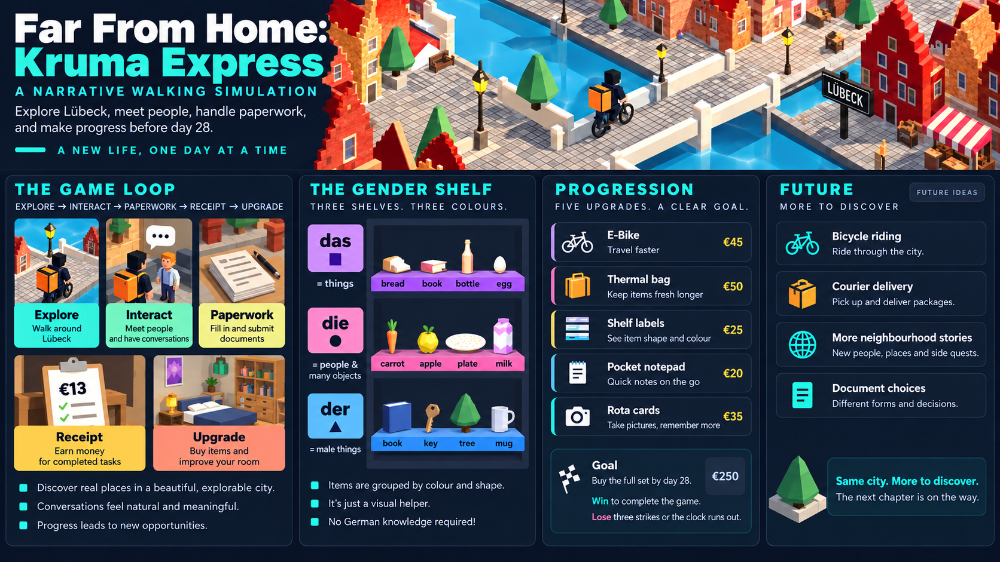

# Far From Home: Kruma Express

## One-page game design document

**High concept:** A narrative courier-management sim about an international student arriving in Lübeck with €20, a 28-day visa clock, and a bureaucracy that refuses to become emotionally available. British deadpan comedy meets German municipal precision.



**Player promise:** Explore a compact 3D Lübeck diorama, meet people, take courier shifts, make deliveries, survive paperwork and gradually turn precarious work into a permanent home. The game is English-first and is not a language-learning game. German is comedy texture, signage and bureaucratic flavour.

**Core loop**

`Explore → meet people → pack a shift → ride → deliver → receive a receipt → buy an upgrade → observe the change → repeat`

Every shift converts decisions into money. Accuracy, early picks, streaks and doorstep etiquette increase earnings; mis-picks, potholes, food, hostel rent and deposits reduce them. The player begins with €20 and works towards the €250 tuition target while completing the document gauntlet before day 28.

**Signature mechanic:** The warehouse files groceries by grammatical gender because, naturally, a German warehouse would. The bottom tier is `der`, blue ▲; the middle is `die`, pink ●; the top is `das`, purple ■. Items are labelled English-first, so the player reads the item and matches the colour and symbol. From Shift 2 onward, the correct rail pulses before the item resolves. An early correct pick pays a 2.0× bonus. The absurd rule becomes a useful search filter and then a speed skill.

**Narrative and choices:** Nico, Rita, Klaus, Nina, Mathias, neighbours, officials and customers remember the player’s behaviour. Formality, punctuality, quiet hours, cash work and missing documents create pressure without turning the game into a moral lecture. The tone is dry, observant and warm underneath the paperwork.

**Progression:** Five visible upgrades make the economy tangible: E-Bike (€45, faster transit), Thermal Bag (€50, slower freshness loss), Shelf Labels (€25, clearer tier symbols), Pocket Notepad (€20, one free rail re-pulse) and Shift Rota Cards (€35, shorter icon delay and stronger early-pick rewards). Each upgrade changes a mechanic and something visible in the room, bike or shift interface.

**Art and interaction:** A fixed 390×844 portrait viewport, designed for one-thumb play. Procedural Three.js geometry creates a readable stepped-gable city, canal routes, cobbled streets and small interior dioramas. Cel-shaded colour, simple silhouettes and document-like UI keep the important information legible on a phone.

**Technical thesis:** The game ships as one offline HTML entry point with vendored Three.js, zero external requests and a strict 35 MB competition limit. Sounds are synthesised at runtime apart from the inlined music track. The design prioritises a complete, focused loop over open-world sprawl.

**Future:** Expand consequences, not map size: more persistent neighbours, more document dependencies, more shift variations and more visible upgrade states. The goal is a denser story of making progress inside an unfair system, without losing the single joke that holds the whole game together.

## Build and play

```bash
node build/assemble.js
open index.html
```

## Project documents

- [Master game design authority](README_HACKATHON.md)
- [Canonical numbers and economy](Docs/CANONICAL_NUMBERS.md)
- [One-page written design document](Docs/ONE_PAGE_DESIGN_DOCUMENT.md)
- [Design intent document](Docs/submission/DESIGN_INTENT_DOC.md)
- [Devpost submission answers](Docs/submission/DEVPOST_SUBMISSION_FORM.md)
- [Presentation and narration script](Docs/submission/PRESENTATION_SCRIPT.md)
